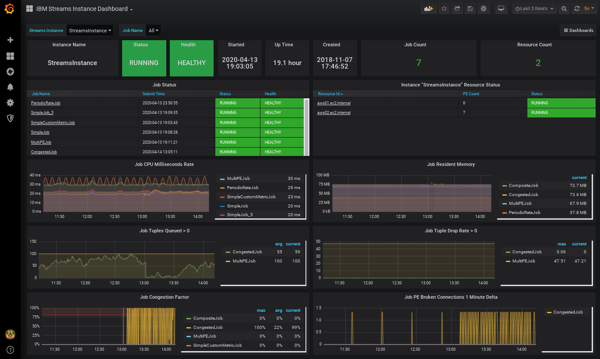
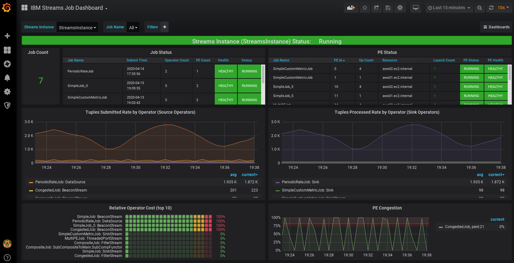
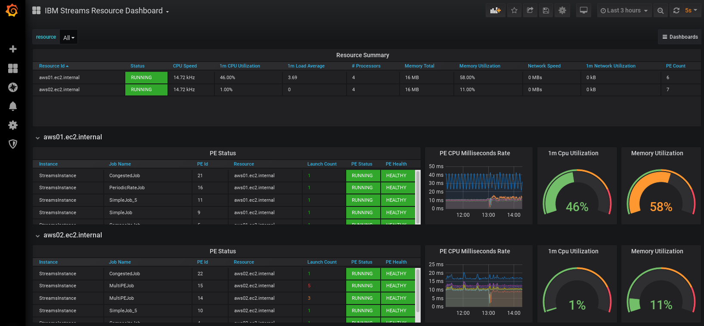

# streamsx.jmxclients: JMX Client apps and Samples for IBM Streams

| Application | Description |
| ----------- | ----------- |
| [streams-metric-exporter](streams-metric-exporter/) | IBM Streams Metric Exporter for Prometheus. Connects to the IBM Streams JMX Server and pulls metrics for one or more IBM Streams instances and jobs using the very efficient InstanceMXBean.jobSnapshotMetrics() call. The metrics are available to Prometheus for scraping via HTTP or HTTPS.  Instructions and supporting files for implementing with Prometheus and Grafana via docker-compose are included. [Grafana Dashboard Examples](streams-metric-exporter/dashboards/)   |
| [streams-jmx-client](streams-jmx-client/) | IBM Streams Command Line Interface similar to streamtool command.  This application uses JMX connection and does not require colocation with an IBM Streams Installation.  It is great for running on mac osx, windows, and lightweight docker images. It support username/password as well as PKI certificate authentication.  The list of commands supported will grow.  Contributions welcome!!|
