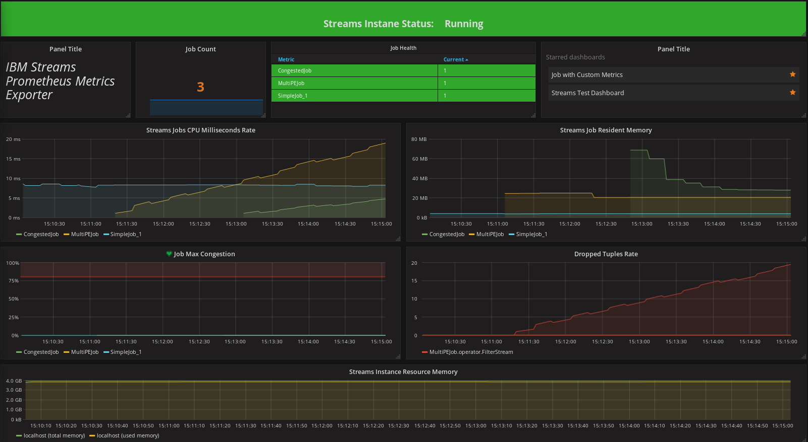

# streams-metric-exporter

This application provides an interface to the IBM Streams - Stream Processing System for the purposes of retrieving status and metrics of streams instances, jobs, and resources.

This version provides 2 HTTP/HTTPS interfaces:
* Prometheus: HTTP/Text endpoint in Prometheus metrics format.
* REST: Multiple endpoints returning json.

IBM Streams provides a JMX Service (with HTTP GET interface for batch metric pulls) that is capable of providing status of the Streams instance, deployed streaming application (jobs), and cluster resources.  In addition, metrics are available via the Streams JMX Server.

The primary use-case for this application is as a Prometheus metrics exporter to provide time series displays using Grafana.
It is meant to be used as a Streams Application Metrics exporter.  It is not meant to monitor the internal system services of IBM Streams.
This application improves performance over per-job metric scraping by periodically (optionally on-demand) pulling all job metrics (via the JMX Server HTTP callbacks) and caching them.  Users can use the REST endpoints (including Prometheus endpoint) to get metrics and status of specific jobs.

The service can be configured with periodic refresh (refresh rate > 0) or on-demand refresh (refresh rate == 0) when the HTTP/HTTPS endpoints are accessed.

The REST service supports HTTP and HTTPS with One-way SSL Authentication.

## Questions
For questions and issues, please contact:

Brian M Williams, IBM<br>
bmwilli@us.ibm.com

# Contents
1. [Building streams-metric-exporter](#building-the-application)
2. [Command line options](#command-line-options)
3. [Running streams-metric-exporter](#running-the-application)
4. [Prometheus Integration](#prometheus-integration)
5. [Grafana Dashboard Example](#grafana-examples)
6. [Running with Docker](#running-with-docker)
7. [Cached REST endpoints](#cached-rest-endpoints)
8. [Passthrough REST endpoints](#passthrough-rest-endpoints)

# Building the application

## Dependencies
The build location must be a linux node with IBM Streams installed.

The environment variable (STREAMS_INSTALL) must be set.

The pom.xml file references the IBM Streams JMX API classes in the product directory.

Another option is to copy the necessary files to the local machine and modify the pom.xml files

## Compiling the application
```
mvn compile
```

## Create executable .jar with dependencies included
```
mvn package
```

Location will be: target/executable-streams-metric-exporter.jar

# Command line options
`java -jar target/executable-streams-metric-exporter.jar --help`

<pre>
Usage: streams-metric-exporter [options]
  Options:
    -d, --domain
      Streams domain name
      Environment Variable: STREAMS_DOMAIN_ID
    --help
      Display command line arguments
    -h, --host
      Listen Host or IP address for this service (e.g. localhost)
      Environment Variable: STREAMS_EXPORTER_HOST
      Default: localhost
    -i, --instance
      Streams instance name
      Environment Variable: STREAMS_INSTANCE_ID
    --jmxssloption
      SSL Option for connection to Streams JMX Server (e.g. SSL_TLSv2, TSLv1.1, TLSv1.2)
      Environment Variable:
      STREAMS_EXPORTER_JMX_SSLOPTION
      Default: TLSv1
    --jmxtruststore
      Java keystore of certificates/signers to trust from JMX Server
      Environment Variable: STREAMS_EXPORTER_JMX_TRUSTSTORE
    -j, --jmxurl
      JMX Connection URL (e.g. service:jmx:jmxmp://localhost:9975)
      Environment Variable: STREAMS_EXPORTER_JMXCONNECT
    --noconsole
      Flag to indicate not to prompt for password (can still redirect from stdin or use environment variable for password.
      Default: false
    --password
      Streams login password. Recommend using environment variable
      Environment Variable: STREAMS_EXPORTER_PASSWORD
    -p, --port
      Listen Port for this service
      Environment Variable: STREAMS_EXPORTER_PORT
      Default: 25500
    -r, --refresh
      Refresh rate of metrics in seconds or 0 for no automatic refresh
      Environment Variable: STREAMS_EXPORTER_REFRESHRATE
      Default: 10
    --serverkeystore
      Java keystore containing server certificate and key to identify server side of this application
      Environment Variable: STREAMS_EXPORTER_SERVER_KEYSTORE 
    --serverkeystorepwd
      Passphrase to java keystore.  Passphrase of keystore and key (if it has one) must match
      Environment Variable: STREAMS_EXPORTER_SERVER_KEYSTORE_PWD 
    --serverprotocol
      http or https.  https will use one-way ssl authentication and java default for tls level (TLSv1.2)
      Environment Variable: STREAMS_EXPORTER_SERVER_PROTOCOL
      Default: http
    -u, --user
      Streams login username. Use this or X509CERT
      Environment Variable: STREAMS_EXPORTER_USERNAME
    --webPath,
      Base URI prefix (e.g. /someprefix)
      Environment Variable: STREAMS_EXPORTER_WEBPATH
      Default: /
    -x, --x509cert
      X509 Certificate file to use instead of username/password
      Environment Variable: STREAMS_X509CERT

</pre>

# Running the application
```
java -jar target/executable-streams-metric-exporter.jar -j \
service:jmx:jmxmp://localhost:9975 -d StreamsDomain -i \
StreamsInstance -u streamsadmin

password: <enter streamsadmin password>
```
# Prometheus Integration

## Endpoint

```bash
/prometheus
```
## prometheus.yml
```yml
  - job_name: "ibmstreams"
    scrape_interval: "15s"
    metrics_path: "/prometheus"
    static_configs:
    - targets: ['localhost:25500']
```
## Metric Names
The set of metrics exposed in continuously increasing as this is active development
The metric names chosen for this endpoint are a hybrid of prometheus naming conventions and the pre-defined metrics of IBMStreams.
The pattern for metric names is<br>

```streams_<objecttype>[_<subobjecttype>]_[_<aggregationtype>]_<streams metric>```

Examples
```
streams_operator_ip_nTuplesProcessed
streams_job_max_congestionFactor
```

| Metric Name Prefix | Description |
| :----------------- | :---------- |
| **streams_instance_**|instance level metrics and status|
| **streams_resource_**|streams resource metrics|
| **streams_job_**|streams job metrics|
| **streams_pe_**|streams pe metrics|
| **streams_pe_ip_**|streams pe input port metrics|
| **streams_pe_op_**|streams pe output port metrics|
| **streams_pe_op_connection_**|streams pe output port connection metrics|
| **streams_operator_**|streams operator metrics|
| **streams_operator_ip_**|streams operator input port metrics|
| **streams_operator_op_**|streams operatore output port metrics|

## Metric Labels
The prometheus metric names are not specific to streams objects (e.g. a specific job), rather, they are for an object type (e.g. operator input port).  The labels are used to identify the individual instances (e.g. job: job_1, operator: myBeacon, input port: StockTickersIn).

| Label Name | Description     |
| :------------- | :------------- |
|**domainname**|name of the streams domain
|**instancename**|name of streams instance (instance is reserved by prometheus)|
|**jobname**| name of streams job (job is reserved by prometheus)|
|**operatorname**| name of operator|
|**inputportname**| name of input port|
|**outputportname**| name of output port|
|**resource**| name of streams resource|
|**peid**|id of streams processing element|
|**index**|index of pe input or output port|
|**connectionid**|connection id of streams pe output port connection|

## Prometheus endpoint example

```
# HELP streams_instance_jobCount Number of jobs currently deployed into the streams instance
# TYPE streams_instance_jobCount gauge
streams_instance_jobCount{instancename="StreamsInstance",} 3.0

# HELP streams_job_pecount Number of pes deployed for this job
# TYPE streams_job_pecount gauge
streams_job_pecount{instancename="StreamsInstance",jobname="MultiPEJob",} 2.0

# HELP streams_operator_ip_nTuplesProcessed Streams operator input port metric: nTuplesProcessed
# TYPE streams_operator_ip_nTuplesProcessed gauge
streams_operator_ip_nTuplesProcessed{instancename="StreamsInstance",jobname="CompositeJob",operatorname="SubCompositeToMain.SubCompFunctor",inputportname="SubCompIn",} 1227489.0
```

# Grafana Examples
See [dashboards directory](dashboards/README.md) for more information.



# Running with Docker

The easiest way to try out the Streams Metric Exporter is to run it using Docker.  Included in this release is a Dockerfile for building the image and a docker-compose.yml file for starting it up with Prometheus and Grafana instances.

The versions of Prometheus and Grafana specified in the docker-compose.yml file are those that were used for initial testing.

## Prerequisites

* Compiled version of Streams Metric Exporter (executable-streams-metric-exporter.jar)
* JMX Access to a running IBM Streams 4.2.1 Domain (JMX Port 9975 is the default)
* Docker Engine (version 17.05.0.ce used in development)
* Docker Compose (version 1.9.0-5 with .yml file format 2 used in development)
* Access to Dockerhub or local repository with Images:
  * ibmjava:sfj (or any 1.8 version)
  * prom/prometheus (2.0.0 used in development)
  * grafana/grafana (4.6.1 used in development)

## Setup environment

1. Change to the docker directory in this project<br>
```bash
cd docker
```
2. Create .env file from sample.env
```
cp sample.env .env
```
3. Edit .env to set authentication for streams jmx Server
```
STREAMS_EXPORTER_USERNAME=<username with domain/instance read access>
STREAMS_EXPORTER_PASSWORD=<user password for pam authentication>
```
4. Export additional environment variables via .env file or from the command line
```
export STREAMS_EXPORTER_JMXCONNECT=service:jmx:jmxmp://<jmxhost>:<jmxport>
export STREAMS_DOMAIN_ID=<domain id>
export STREAMS_INSTANCE_ID=<instance id>
```
5. Build / Run Docker Images
```
docker-compose up
```
6. Create Prometheus data source in grafana
```bash
../scripts/create_datasource.sh
```
7. Import sample dashboard into Grafana
```
../scripts/import_dashboard.sh ../dashboards/StreamsSampleDashboard_apiCreate.json
```
8. Open Grafana in browswer
```
http://localhost:3000
```
9. Login with default username/password
```
admin/admin
```
10. Navigate to Home Dashboard
```
IBM Streams Sample Dashboard
```

# Cached REST endpoints
## /instance
Retrieve status of instance being monitored

`curl http://localhost:25500/instance`

```json
{

    "instanceName": "StreamsInstance",
    "instanceStatus": "running",
    "instanceStartTime": 1506945075968

}
```

## /instance/resourceMetrics
Retrieves resources and specific metrics about them

`curl http://localhost:25500/instance/resourceMetrics`

```json
{

    "streamsqse.localdomain": {
        "cpuSpeed": 8677,
        "memoryFree": 385960,
        "memoryTotal": 3908520,
        "loadAverage": 0,
        "nProcessors": 2
    }

}
```

## /joblist
List of job names and ids along with links to details about the job

`curl http://localhost:25500/joblist`

```json
{

    "total": 1,
    "jobs": [
        {
            "name": "SimpleJob_0",
            "id": 0,
            "metrics": "http://localhost:25500/jobs/0/metrics",
            "jobInfo": "http://localhost:25500/jobs/0",
            "snapshot": "http://localhost:25500/jobs/0/snapshot"
        }
    ]

}
```

## /jobs/{jobid}/status
Status of a single job

`curl http://localhost:25500/jobs/{jobid}/status`

```json
{
    "status": "running"
}
```

## /jobs/{jobid}/health
Health of a single job

`curl http://localhost:25500/jobs/{jobid}/health`

```json
{
    "health": "healthy"
}
```

## /jobs/{jobid}/metrics
Metrics of a single job

`curl http://localhost:25500/jobs/{jobid}/metrics`

```json
{

    "lastMetricsRefresh": 1506958998911,
    "lastMetricsFailure": null,
    "lastMetricsRefreshFailed": false,
    "jobMetrics": {
        "id": "0",
        "pes": [
            {
                "indexWithinJob": 0,
                "operators": [
                    {
                        "outputPorts": [
                            {
                                "indexWithinOperator": 0,
                                "name": "SinkStream",
                                "metrics": [
                                    {
                                        "name": "nTuplesSubmitted",
                                        "value": 676291
                                    },
                                    {
                                        "name": "nFinalPunctsSubmitted",
                                        "value": 0
                                    },
                                    {
                                        "name": "nWindowPunctsSubmitted",
                                        "value": 0
                                    }
                                ]
                            }
                        ],
                        "name": "SinkStream",
                        "inputPorts": [
                            {
                                "indexWithinOperator": 0,
                                "name": "FunctorStream",
                                "metrics": [
                                    {
                                        "name": "queueSize",
                                        "value": 0
                                    },
                                    {
                                        "name": "nWindowPunctsQueued",
                                        "value": 0
                                    },
                                    {
                                        "name": "nTuplesQueued",
                                        "value": 0
                                    },
                                    {
                                        "name": "nTuplesDropped",
                                        "value": 0
                                    },
                                    {
                                        "name": "nTuplesProcessed",
                                        "value": 676291
                                    },
                                    {
                                        "name": "nWindowPunctsProcessed",
                                        "value": 0
                                    },
                                    {
                                        "name": "nFinalPunctsQueued",
                                        "value": 0
                                    },
                                    {
                                        "name": "nFinalPunctsProcessed",
                                        "value": 0
                                    }
                                ]
                            }
                        ],
                        "metrics": [ ]
                    },
                    {
                        "outputPorts": [ ],
                        "name": "Sink",
                        "inputPorts": [
                            {
                                "indexWithinOperator": 0,
                                "name": "In",
                                "metrics": [
                                    {
                                        "name": "nWindowPunctsProcessed",
                                        "value": 0
                                    },
                                    {
                                        "name": "nTuplesProcessed",
                                        "value": 676291
                                    },
                                    {
                                        "name": "nWindowPunctsQueued",
                                        "value": 0
                                    },
                                    {
                                        "name": "queueSize",
                                        "value": 0
                                    },
                                    {
                                        "name": "nFinalPunctsQueued",
                                        "value": 0
                                    },
                                    {
                                        "name": "nTuplesDropped",
                                        "value": 0
                                    },
                                    {
                                        "name": "nTuplesQueued",
                                        "value": 0
                                    },
                                    {
                                        "name": "nFinalPunctsProcessed",
                                        "value": 0
                                    }
                                ]
                            }
                        ],
                        "metrics": [ ]
                    },
                    {
                        "outputPorts": [
                            {
                                "indexWithinOperator": 0,
                                "name": "FunctorStream",
                                "metrics": [
                                    {
                                        "name": "nWindowPunctsSubmitted",
                                        "value": 0
                                    },
                                    {
                                        "name": "nTuplesSubmitted",
                                        "value": 676291
                                    },
                                    {
                                        "name": "nFinalPunctsSubmitted",
                                        "value": 0
                                    }
                                ]
                            }
                        ],
                        "name": "FunctorStream",
                        "inputPorts": [
                            {
                                "indexWithinOperator": 0,
                                "name": "FilterStream",
                                "metrics": [
                                    {
                                        "name": "nTuplesProcessed",
                                        "value": 676291
                                    },
                                    {
                                        "name": "nWindowPunctsQueued",
                                        "value": 0
                                    },
                                    {
                                        "name": "queueSize",
                                        "value": 0
                                    },
                                    {
                                        "name": "nFinalPunctsQueued",
                                        "value": 0
                                    },
                                    {
                                        "name": "nWindowPunctsProcessed",
                                        "value": 0
                                    },
                                    {
                                        "name": "nTuplesQueued",
                                        "value": 0
                                    },
                                    {
                                        "name": "nTuplesDropped",
                                        "value": 0
                                    },
                                    {
                                        "name": "nFinalPunctsProcessed",
                                        "value": 0
                                    }
                                ]
                            }
                        ],
                        "metrics": [ ]
                    },
                    {
                        "outputPorts": [
                            {
                                "indexWithinOperator": 0,
                                "name": "BeaconStream",
                                "metrics": [
                                    {
                                        "name": "nTuplesSubmitted",
                                        "value": 1352582
                                    },
                                    {
                                        "name": "nWindowPunctsSubmitted",
                                        "value": 0
                                    },
                                    {
                                        "name": "nFinalPunctsSubmitted",
                                        "value": 0
                                    }
                                ]
                            }
                        ],
                        "name": "BeaconStream",
                        "inputPorts": [ ],
                        "metrics": [ ]
                    },
                    {
                        "outputPorts": [
                            {
                                "indexWithinOperator": 0,
                                "name": "FilterStream",
                                "metrics": [
                                    {
                                        "name": "nTuplesSubmitted",
                                        "value": 676291
                                    },
                                    {
                                        "name": "nWindowPunctsSubmitted",
                                        "value": 0
                                    },
                                    {
                                        "name": "nFinalPunctsSubmitted",
                                        "value": 0
                                    }
                                ]
                            }
                        ],
                        "name": "FilterStream",
                        "inputPorts": [
                            {
                                "indexWithinOperator": 0,
                                "name": "BeaconStream",
                                "metrics": [
                                    {
                                        "name": "nFinalPunctsProcessed",
                                        "value": 0
                                    },
                                    {
                                        "name": "nTuplesProcessed",
                                        "value": 1352582
                                    },
                                    {
                                        "name": "nFinalPunctsQueued",
                                        "value": 0
                                    },
                                    {
                                        "name": "nWindowPunctsQueued",
                                        "value": 0
                                    },
                                    {
                                        "name": "queueSize",
                                        "value": 0
                                    },
                                    {
                                        "name": "nTuplesQueued",
                                        "value": 0
                                    },
                                    {
                                        "name": "nTuplesDropped",
                                        "value": 0
                                    },
                                    {
                                        "name": "nWindowPunctsProcessed",
                                        "value": 0
                                    }
                                ]
                            }
                        ],
                        "metrics": [ ]
                    }
                ],
                "outputPorts": [ ],
                "inputPorts": [ ],
                "id": "0",
                "metrics": [
                    {
                        "name": "nResidentMemoryConsumption",
                        "value": 33892
                    },
                    {
                        "name": "nMemoryConsumption",
                        "value": 810016
                    },
                    {
                        "name": "nCpuMilliseconds",
                        "value": 61950
                    }
                ],
                "lastTimeRetrieved": 1506958996000
            }
        ]
    }

}
```

## /jobs
Array of all jobs in the instance along with job information and the metrics for each job

`curl http://localhost:25500/jobs`

```json
{

    "total": 1,
    "jobs": [
        {
            "id": 0,
            "status": "running",
            "lastMetricsRefresh": 1506958518905,
            "lastMetricsFailure": null,
            "lastMetricsRefreshFailed": false,
            "adlFile": "output/SimpleJob.adl",
            "applicationName": "SimpleJob",
            "applicationPath": "toolkits/SimpleJob",
            "applicationScope": "Default",
            "applicationVersion": "4211",
            "dataPath": "/home/streamsadmin/git/streams/spl/SimpleJob/-a",
            "domain": "StreamsDomain",
            "health": "HEALTHY",
            "instance": "StreamsInstance",
            "jobGroup": "default",
            "name": "SimpleJob_0",
            "outputPath": "output",
            "startedByUser": "streamsadmin",
            "submitTime": 1506945170000,
            "jobMetrics": {
                "id": "0",
                "pes": [
                    {
                        "indexWithinJob": 0,
                        "operators": [
                            {
                                "outputPorts": [
                                    {
                                        "indexWithinOperator": 0,
                                        "name": "SinkStream",
                                        "metrics": [
                                            {
                                                "name": "nTuplesSubmitted",
                                                "value": 652797
                                            },
                                            {
                                                "name": "nFinalPunctsSubmitted",
                                                "value": 0
                                            },
                                            {
                                                "name": "nWindowPunctsSubmitted",
                                                "value": 0
                                            }
                                        ]
                                    }
                                ],
                                "name": "SinkStream",
                                "inputPorts": [
                                    {
                                        "indexWithinOperator": 0,
                                        "name": "FunctorStream",
                                        "metrics": [
                                            {
                                                "name": "nWindowPunctsQueued",
                                                "value": 0
                                            },
                                            {
                                                "name": "nFinalPunctsQueued",
                                                "value": 0
                                            },
                                            {
                                                "name": "nTuplesQueued",
                                                "value": 0
                                            },
                                            {
                                                "name": "nTuplesDropped",
                                                "value": 0
                                            },
                                            {
                                                "name": "nTuplesProcessed",
                                                "value": 652797
                                            },
                                            {
                                                "name": "nWindowPunctsProcessed",
                                                "value": 0
                                            },
                                            {
                                                "name": "nFinalPunctsProcessed",
                                                "value": 0
                                            },
                                            {
                                                "name": "queueSize",
                                                "value": 0
                                            }
                                        ]
                                    }
                                ],
                                "metrics": [ ]
                            },
                            {
                                "outputPorts": [ ],
                                "name": "Sink",
                                "inputPorts": [
                                    {
                                        "indexWithinOperator": 0,
                                        "name": "In",
                                        "metrics": [
                                            {
                                                "name": "nFinalPunctsQueued",
                                                "value": 0
                                            },
                                            {
                                                "name": "nTuplesQueued",
                                                "value": 0
                                            },
                                            {
                                                "name": "nFinalPunctsProcessed",
                                                "value": 0
                                            },
                                            {
                                                "name": "nWindowPunctsProcessed",
                                                "value": 0
                                            },
                                            {
                                                "name": "queueSize",
                                                "value": 0
                                            },
                                            {
                                                "name": "nTuplesDropped",
                                                "value": 0
                                            },
                                            {
                                                "name": "nTuplesProcessed",
                                                "value": 652797
                                            },
                                            {
                                                "name": "nWindowPunctsQueued",
                                                "value": 0
                                            }
                                        ]
                                    }
                                ],
                                "metrics": [ ]
                            },
                            {
                                "outputPorts": [
                                    {
                                        "indexWithinOperator": 0,
                                        "name": "FunctorStream",
                                        "metrics": [
                                            {
                                                "name": "nFinalPunctsSubmitted",
                                                "value": 0
                                            },
                                            {
                                                "name": "nTuplesSubmitted",
                                                "value": 652797
                                            },
                                            {
                                                "name": "nWindowPunctsSubmitted",
                                                "value": 0
                                            }
                                        ]
                                    }
                                ],
                                "name": "FunctorStream",
                                "inputPorts": [
                                    {
                                        "indexWithinOperator": 0,
                                        "name": "FilterStream",
                                        "metrics": [
                                            {
                                                "name": "queueSize",
                                                "value": 0
                                            },
                                            {
                                                "name": "nFinalPunctsProcessed",
                                                "value": 0
                                            },
                                            {
                                                "name": "nWindowPunctsQueued",
                                                "value": 0
                                            },
                                            {
                                                "name": "nTuplesProcessed",
                                                "value": 652797
                                            },
                                            {
                                                "name": "nTuplesDropped",
                                                "value": 0
                                            },
                                            {
                                                "name": "nFinalPunctsQueued",
                                                "value": 0
                                            },
                                            {
                                                "name": "nWindowPunctsProcessed",
                                                "value": 0
                                            },
                                            {
                                                "name": "nTuplesQueued",
                                                "value": 0
                                            }
                                        ]
                                    }
                                ],
                                "metrics": [ ]
                            },
                            {
                                "outputPorts": [
                                    {
                                        "indexWithinOperator": 0,
                                        "name": "BeaconStream",
                                        "metrics": [
                                            {
                                                "name": "nFinalPunctsSubmitted",
                                                "value": 0
                                            },
                                            {
                                                "name": "nWindowPunctsSubmitted",
                                                "value": 0
                                            },
                                            {
                                                "name": "nTuplesSubmitted",
                                                "value": 1305594
                                            }
                                        ]
                                    }
                                ],
                                "name": "BeaconStream",
                                "inputPorts": [ ],
                                "metrics": [ ]
                            },
                            {
                                "outputPorts": [
                                    {
                                        "indexWithinOperator": 0,
                                        "name": "FilterStream",
                                        "metrics": [
                                            {
                                                "name": "nWindowPunctsSubmitted",
                                                "value": 0
                                            },
                                            {
                                                "name": "nTuplesSubmitted",
                                                "value": 652797
                                            },
                                            {
                                                "name": "nFinalPunctsSubmitted",
                                                "value": 0
                                            }
                                        ]
                                    }
                                ],
                                "name": "FilterStream",
                                "inputPorts": [
                                    {
                                        "indexWithinOperator": 0,
                                        "name": "BeaconStream",
                                        "metrics": [
                                            {
                                                "name": "nTuplesQueued",
                                                "value": 0
                                            },
                                            {
                                                "name": "nTuplesDropped",
                                                "value": 0
                                            },
                                            {
                                                "name": "nWindowPunctsQueued",
                                                "value": 0
                                            },
                                            {
                                                "name": "queueSize",
                                                "value": 0
                                            },
                                            {
                                                "name": "nFinalPunctsQueued",
                                                "value": 0
                                            },
                                            {
                                                "name": "nWindowPunctsProcessed",
                                                "value": 0
                                            },
                                            {
                                                "name": "nTuplesProcessed",
                                                "value": 1305594
                                            },
                                            {
                                                "name": "nFinalPunctsProcessed",
                                                "value": 0
                                            }
                                        ]
                                    }
                                ],
                                "metrics": [ ]
                            }
                        ],
                        "outputPorts": [ ],
                        "inputPorts": [ ],
                        "id": "0",
                        "metrics": [
                            {
                                "name": "nMemoryConsumption",
                                "value": 810016
                            },
                            {
                                "name": "nResidentMemoryConsumption",
                                "value": 33892
                            },
                            {
                                "name": "nCpuMilliseconds",
                                "value": 60000
                            }
                        ],
                        "lastTimeRetrieved": 1506958516000
                    }
                ]
            }
        }
    ]

}
```

## /jobs/{jobid}
Job information and metrics for a single job

`curl http://localhost:25500/jobs/{jobid}`

```json
{

    "id": 0,
    "status": "running",
    "lastMetricsRefresh": 1506958648907,
    "lastMetricsFailure": null,
    "lastMetricsRefreshFailed": false,
    "adlFile": "output/SimpleJob.adl",
    "applicationName": "SimpleJob",
    "applicationPath": "toolkits/SimpleJob",
    "applicationScope": "Default",
    "applicationVersion": "4211",
    "dataPath": "/home/streamsadmin/git/streams/spl/SimpleJob/-a",
    "domain": "StreamsDomain",
    "health": "HEALTHY",
    "instance": "StreamsInstance",
    "jobGroup": "default",
    "name": "SimpleJob_0",
    "outputPath": "output",
    "startedByUser": "streamsadmin",
    "submitTime": 1506945170000,
    "jobMetrics": {
        "id": "0",
        "pes": [
            {
                "indexWithinJob": 0,
                "operators": [
                    {
                        "outputPorts": [
                            {
                                "indexWithinOperator": 0,
                                "name": "SinkStream",
                                "metrics": [
                                    {
                                        "name": "nWindowPunctsSubmitted",
                                        "value": 0
                                    },
                                    {
                                        "name": "nFinalPunctsSubmitted",
                                        "value": 0
                                    },
                                    {
                                        "name": "nTuplesSubmitted",
                                        "value": 659115
                                    }
                                ]
                            }
                        ],
                        "name": "SinkStream",
                        "inputPorts": [
                            {
                                "indexWithinOperator": 0,
                                "name": "FunctorStream",
                                "metrics": [
                                    {
                                        "name": "queueSize",
                                        "value": 0
                                    },
                                    {
                                        "name": "nTuplesQueued",
                                        "value": 0
                                    },
                                    {
                                        "name": "nTuplesDropped",
                                        "value": 0
                                    },
                                    {
                                        "name": "nWindowPunctsQueued",
                                        "value": 0
                                    },
                                    {
                                        "name": "nFinalPunctsQueued",
                                        "value": 0
                                    },
                                    {
                                        "name": "nWindowPunctsProcessed",
                                        "value": 0
                                    },
                                    {
                                        "name": "nFinalPunctsProcessed",
                                        "value": 0
                                    },
                                    {
                                        "name": "nTuplesProcessed",
                                        "value": 659115
                                    }
                                ]
                            }
                        ],
                        "metrics": [ ]
                    },
                    {
                        "outputPorts": [ ],
                        "name": "Sink",
                        "inputPorts": [
                            {
                                "indexWithinOperator": 0,
                                "name": "In",
                                "metrics": [
                                    {
                                        "name": "nTuplesProcessed",
                                        "value": 659115
                                    },
                                    {
                                        "name": "nTuplesDropped",
                                        "value": 0
                                    },
                                    {
                                        "name": "nWindowPunctsQueued",
                                        "value": 0
                                    },
                                    {
                                        "name": "nFinalPunctsQueued",
                                        "value": 0
                                    },
                                    {
                                        "name": "nTuplesQueued",
                                        "value": 0
                                    },
                                    {
                                        "name": "queueSize",
                                        "value": 0
                                    },
                                    {
                                        "name": "nFinalPunctsProcessed",
                                        "value": 0
                                    },
                                    {
                                        "name": "nWindowPunctsProcessed",
                                        "value": 0
                                    }
                                ]
                            }
                        ],
                        "metrics": [ ]
                    },
                    {
                        "outputPorts": [
                            {
                                "indexWithinOperator": 0,
                                "name": "FunctorStream",
                                "metrics": [
                                    {
                                        "name": "nWindowPunctsSubmitted",
                                        "value": 0
                                    },
                                    {
                                        "name": "nFinalPunctsSubmitted",
                                        "value": 0
                                    },
                                    {
                                        "name": "nTuplesSubmitted",
                                        "value": 659115
                                    }
                                ]
                            }
                        ],
                        "name": "FunctorStream",
                        "inputPorts": [
                            {
                                "indexWithinOperator": 0,
                                "name": "FilterStream",
                                "metrics": [
                                    {
                                        "name": "nTuplesProcessed",
                                        "value": 659115
                                    },
                                    {
                                        "name": "nTuplesDropped",
                                        "value": 0
                                    },
                                    {
                                        "name": "nWindowPunctsQueued",
                                        "value": 0
                                    },
                                    {
                                        "name": "queueSize",
                                        "value": 0
                                    },
                                    {
                                        "name": "nWindowPunctsProcessed",
                                        "value": 0
                                    },
                                    {
                                        "name": "nTuplesQueued",
                                        "value": 0
                                    },
                                    {
                                        "name": "nFinalPunctsProcessed",
                                        "value": 0
                                    },
                                    {
                                        "name": "nFinalPunctsQueued",
                                        "value": 0
                                    }
                                ]
                            }
                        ],
                        "metrics": [ ]
                    },
                    {
                        "outputPorts": [
                            {
                                "indexWithinOperator": 0,
                                "name": "BeaconStream",
                                "metrics": [
                                    {
                                        "name": "nTuplesSubmitted",
                                        "value": 1318230
                                    },
                                    {
                                        "name": "nFinalPunctsSubmitted",
                                        "value": 0
                                    },
                                    {
                                        "name": "nWindowPunctsSubmitted",
                                        "value": 0
                                    }
                                ]
                            }
                        ],
                        "name": "BeaconStream",
                        "inputPorts": [ ],
                        "metrics": [ ]
                    },
                    {
                        "outputPorts": [
                            {
                                "indexWithinOperator": 0,
                                "name": "FilterStream",
                                "metrics": [
                                    {
                                        "name": "nFinalPunctsSubmitted",
                                        "value": 0
                                    },
                                    {
                                        "name": "nWindowPunctsSubmitted",
                                        "value": 0
                                    },
                                    {
                                        "name": "nTuplesSubmitted",
                                        "value": 659115
                                    }
                                ]
                            }
                        ],
                        "name": "FilterStream",
                        "inputPorts": [
                            {
                                "indexWithinOperator": 0,
                                "name": "BeaconStream",
                                "metrics": [
                                    {
                                        "name": "nFinalPunctsProcessed",
                                        "value": 0
                                    },
                                    {
                                        "name": "nWindowPunctsQueued",
                                        "value": 0
                                    },
                                    {
                                        "name": "nWindowPunctsProcessed",
                                        "value": 0
                                    },
                                    {
                                        "name": "nTuplesProcessed",
                                        "value": 1318230
                                    },
                                    {
                                        "name": "queueSize",
                                        "value": 0
                                    },
                                    {
                                        "name": "nTuplesQueued",
                                        "value": 0
                                    },
                                    {
                                        "name": "nTuplesDropped",
                                        "value": 0
                                    },
                                    {
                                        "name": "nFinalPunctsQueued",
                                        "value": 0
                                    }
                                ]
                            }
                        ],
                        "metrics": [ ]
                    }
                ],
                "outputPorts": [ ],
                "inputPorts": [ ],
                "id": "0",
                "metrics": [
                    {
                        "name": "nCpuMilliseconds",
                        "value": 60520
                    },
                    {
                        "name": "nMemoryConsumption",
                        "value": 810016
                    },
                    {
                        "name": "nResidentMemoryConsumption",
                        "value": 33892
                    }
                ],
                "lastTimeRetrieved": 1506958645000
            }
        ]
    }

}
```


## /jobtracker
The Provides a complete overview of the streams-metric-exporter server.  Not recommended for programatic interface, however, a good interface for status of this server

`curl http://localhost:25500/jobtracker`

```json
{

    "domain": "StreamsDomain",
    "instance": {
        "available": true,
        "name": "StreamsInstance",
        "status": "running",
        "instanceStartTime": "2017 10 02 07:51:15"
    },
    "jobMapAvailable": true,
    "jobMetricsAvailable": true,
    "instanceResourceMetricsLastUpdateTime": "2017 10 02 09:31:41",
    "jobCount": 1,
    "jobMap": [
        {
            "jobInfo": {
                "id": "0",
                "status": "running",
                "applicationName": "SimpleJob",
                "metrics": "{\"id\":\"0\",\"pes\":[{\"indexWithinJob\":0,\"operators\":[{\"outputPorts\":[{\"indexWithinOperator\":0,\"name\":\"SinkStream\",\"metrics\":[{\"name\":\"nFinalPunctsSubmitted\",\"value\":0},{\"name\":\"nTuplesSubmitted\",\"value\":289387},{\"name\":\"nWindowPunctsSubmitted\",\"value\":0}]}],\"name\":\"SinkStream\",\"inputPorts\":[{\"indexWithinOperator\":0,\"name\":\"FunctorStream\",\"metrics\":[{\"name\":\"queueSize\",\"value\":0},{\"name\":\"nFinalPunctsQueued\",\"value\":0},{\"name\":\"nFinalPunctsProcessed\",\"value\":0},{\"name\":\"nTuplesProcessed\",\"value\":289387},{\"name\":\"nWindowPunctsQueued\",\"value\":0},{\"name\":\"nTuplesQueued\",\"value\":0},{\"name\":\"nWindowPunctsProcessed\",\"value\":0},{\"name\":\"nTuplesDropped\",\"value\":0}]}],\"metrics\":[]},{\"outputPorts\":[],\"name\":\"Sink\",\"inputPorts\":[{\"indexWithinOperator\":0,\"name\":\"In\",\"metrics\":[{\"name\":\"nWindowPunctsQueued\",\"value\":0},{\"name\":\"nTuplesProcessed\",\"value\":289387},{\"name\":\"nWindowPunctsProcessed\",\"value\":0},{\"name\":\"nFinalPunctsProcessed\",\"value\":0},{\"name\":\"nTuplesQueued\",\"value\":0},{\"name\":\"nFinalPunctsQueued\",\"value\":0},{\"name\":\"queueSize\",\"value\":0},{\"name\":\"nTuplesDropped\",\"value\":0}]}],\"metrics\":[]},{\"outputPorts\":[{\"indexWithinOperator\":0,\"name\":\"FunctorStream\",\"metrics\":[{\"name\":\"nFinalPunctsSubmitted\",\"value\":0},{\"name\":\"nWindowPunctsSubmitted\",\"value\":0},{\"name\":\"nTuplesSubmitted\",\"value\":289387}]}],\"name\":\"FunctorStream\",\"inputPorts\":[{\"indexWithinOperator\":0,\"name\":\"FilterStream\",\"metrics\":[{\"name\":\"queueSize\",\"value\":0},{\"name\":\"nTuplesDropped\",\"value\":0},{\"name\":\"nTuplesQueued\",\"value\":0},{\"name\":\"nTuplesProcessed\",\"value\":289387},{\"name\":\"nFinalPunctsProcessed\",\"value\":0},{\"name\":\"nWindowPunctsProcessed\",\"value\":0},{\"name\":\"nWindowPunctsQueued\",\"value\":0},{\"name\":\"nFinalPunctsQueued\",\"value\":0}]}],\"metrics\":[]},{\"outputPorts\":[{\"indexWithinOperator\":0,\"name\":\"BeaconStream\",\"metrics\":[{\"name\":\"nWindowPunctsSubmitted\",\"value\":0},{\"name\":\"nTuplesSubmitted\",\"value\":578773},{\"name\":\"nFinalPunctsSubmitted\",\"value\":0}]}],\"name\":\"BeaconStream\",\"inputPorts\":[],\"metrics\":[]},{\"outputPorts\":[{\"indexWithinOperator\":0,\"name\":\"FilterStream\",\"metrics\":[{\"name\":\"nTuplesSubmitted\",\"value\":289387},{\"name\":\"nFinalPunctsSubmitted\",\"value\":0},{\"name\":\"nWindowPunctsSubmitted\",\"value\":0}]}],\"name\":\"FilterStream\",\"inputPorts\":[{\"indexWithinOperator\":0,\"name\":\"BeaconStream\",\"metrics\":[{\"name\":\"nTuplesDropped\",\"value\":0},{\"name\":\"nFinalPunctsProcessed\",\"value\":0},{\"name\":\"nWindowPunctsQueued\",\"value\":0},{\"name\":\"nTuplesQueued\",\"value\":0},{\"name\":\"nFinalPunctsQueued\",\"value\":0},{\"name\":\"nTuplesProcessed\",\"value\":578773},{\"name\":\"queueSize\",\"value\":0},{\"name\":\"nWindowPunctsProcessed\",\"value\":0}]}],\"metrics\":[]}],\"outputPorts\":[],\"inputPorts\":[],\"id\":\"0\",\"metrics\":[{\"name\":\"nCpuMilliseconds\",\"value\":26050},{\"name\":\"nResidentMemoryConsumption\",\"value\":33892},{\"name\":\"nMemoryConsumption\",\"value\":810016}],\"lastTimeRetrieved\":1506951100000}]}"
            }
        }
    ],
    "jobNameIndex": [
        {
            "key": "SimpleJob_0",
            "value": "0"
        }
    ]

}
```

## /metris
Retrieves all metrics for the monitored instance

`curl http://localhost:25500/metrics`

```json
{

    "lastMetricsRefresh": 1506958218912,
    "lastMetricsFailure": null,
    "lastMetricsRefreshFailed": false,
    "allMetrics": {
        "jobs": [
            {
                "id": "0",
                "pes": [
                    {
                        "indexWithinJob": 0,
                        "operators": [
                            {
                                "outputPorts": [
                                    {
                                        "indexWithinOperator": 0,
                                        "metrics": [
                                            {
                                                "name": "nFinalPunctsSubmitted",
                                                "value": 0
                                            },
                                            {
                                                "name": "nTuplesSubmitted",
                                                "value": 638117
                                            },
                                            {
                                                "name": "nWindowPunctsSubmitted",
                                                "value": 0
                                            }
                                        ]
                                    }
                                ],
                                "name": "SinkStream",
                                "inputPorts": [
                                    {
                                        "indexWithinOperator": 0,
                                        "metrics": [
                                            {
                                                "name": "nTuplesDropped",
                                                "value": 0
                                            },
                                            {
                                                "name": "nFinalPunctsQueued",
                                                "value": 0
                                            },
                                            {
                                                "name": "queueSize",
                                                "value": 0
                                            },
                                            {
                                                "name": "nFinalPunctsProcessed",
                                                "value": 0
                                            },
                                            {
                                                "name": "nWindowPunctsQueued",
                                                "value": 0
                                            },
                                            {
                                                "name": "nTuplesQueued",
                                                "value": 0
                                            },
                                            {
                                                "name": "nWindowPunctsProcessed",
                                                "value": 0
                                            },
                                            {
                                                "name": "nTuplesProcessed",
                                                "value": 638117
                                            }
                                        ]
                                    }
                                ],
                                "metrics": [ ]
                            },
                            {
                                "outputPorts": [ ],
                                "name": "Sink",
                                "inputPorts": [
                                    {
                                        "indexWithinOperator": 0,
                                        "metrics": [
                                            {
                                                "name": "nWindowPunctsQueued",
                                                "value": 0
                                            },
                                            {
                                                "name": "nFinalPunctsQueued",
                                                "value": 0
                                            },
                                            {
                                                "name": "queueSize",
                                                "value": 0
                                            },
                                            {
                                                "name": "nWindowPunctsProcessed",
                                                "value": 0
                                            },
                                            {
                                                "name": "nTuplesDropped",
                                                "value": 0
                                            },
                                            {
                                                "name": "nFinalPunctsProcessed",
                                                "value": 0
                                            },
                                            {
                                                "name": "nTuplesProcessed",
                                                "value": 638117
                                            },
                                            {
                                                "name": "nTuplesQueued",
                                                "value": 0
                                            }
                                        ]
                                    }
                                ],
                                "metrics": [ ]
                            },
                            {
                                "outputPorts": [
                                    {
                                        "indexWithinOperator": 0,
                                        "metrics": [
                                            {
                                                "name": "nTuplesSubmitted",
                                                "value": 638117
                                            },
                                            {
                                                "name": "nWindowPunctsSubmitted",
                                                "value": 0
                                            },
                                            {
                                                "name": "nFinalPunctsSubmitted",
                                                "value": 0
                                            }
                                        ]
                                    }
                                ],
                                "name": "FunctorStream",
                                "inputPorts": [
                                    {
                                        "indexWithinOperator": 0,
                                        "metrics": [
                                            {
                                                "name": "nFinalPunctsQueued",
                                                "value": 0
                                            },
                                            {
                                                "name": "queueSize",
                                                "value": 0
                                            },
                                            {
                                                "name": "nTuplesProcessed",
                                                "value": 638117
                                            },
                                            {
                                                "name": "nTuplesQueued",
                                                "value": 0
                                            },
                                            {
                                                "name": "nWindowPunctsProcessed",
                                                "value": 0
                                            },
                                            {
                                                "name": "nTuplesDropped",
                                                "value": 0
                                            },
                                            {
                                                "name": "nWindowPunctsQueued",
                                                "value": 0
                                            },
                                            {
                                                "name": "nFinalPunctsProcessed",
                                                "value": 0
                                            }
                                        ]
                                    }
                                ],
                                "metrics": [ ]
                            },
                            {
                                "outputPorts": [
                                    {
                                        "indexWithinOperator": 0,
                                        "metrics": [
                                            {
                                                "name": "nFinalPunctsSubmitted",
                                                "value": 0
                                            },
                                            {
                                                "name": "nTuplesSubmitted",
                                                "value": 1276233
                                            },
                                            {
                                                "name": "nWindowPunctsSubmitted",
                                                "value": 0
                                            }
                                        ]
                                    }
                                ],
                                "name": "BeaconStream",
                                "inputPorts": [ ],
                                "metrics": [ ]
                            },
                            {
                                "outputPorts": [
                                    {
                                        "indexWithinOperator": 0,
                                        "metrics": [
                                            {
                                                "name": "nWindowPunctsSubmitted",
                                                "value": 0
                                            },
                                            {
                                                "name": "nTuplesSubmitted",
                                                "value": 638117
                                            },
                                            {
                                                "name": "nFinalPunctsSubmitted",
                                                "value": 0
                                            }
                                        ]
                                    }
                                ],
                                "name": "FilterStream",
                                "inputPorts": [
                                    {
                                        "indexWithinOperator": 0,
                                        "metrics": [
                                            {
                                                "name": "nFinalPunctsQueued",
                                                "value": 0
                                            },
                                            {
                                                "name": "nWindowPunctsQueued",
                                                "value": 0
                                            },
                                            {
                                                "name": "nTuplesQueued",
                                                "value": 0
                                            },
                                            {
                                                "name": "nWindowPunctsProcessed",
                                                "value": 0
                                            },
                                            {
                                                "name": "nTuplesProcessed",
                                                "value": 1276233
                                            },
                                            {
                                                "name": "nFinalPunctsProcessed",
                                                "value": 0
                                            },
                                            {
                                                "name": "nTuplesDropped",
                                                "value": 0
                                            },
                                            {
                                                "name": "queueSize",
                                                "value": 0
                                            }
                                        ]
                                    }
                                ],
                                "metrics": [ ]
                            }
                        ],
                        "outputPorts": [ ],
                        "inputPorts": [ ],
                        "id": "0",
                        "metrics": [
                            {
                                "name": "nResidentMemoryConsumption",
                                "value": 33892
                            },
                            {
                                "name": "nCpuMilliseconds",
                                "value": 58740
                            },
                            {
                                "name": "nMemoryConsumption",
                                "value": 810016
                            }
                        ],
                        "lastTimeRetrieved": 1506958216000
                    }
                ]
            }
        ],
        "id": "StreamsInstance"
    }

}
```

# Passthrough REST Endpoints
These endpoints are not cached, rather, they are passed through directly to the Streams JMX Server API

## /jobs/{jobid}/snapshot

Calls the snapshot() jmx method on the specified job

### Parameters:

depth : depth of job topology to return (default: 1)

static: include static job attributes in addition to dynamic attributes (default: true)

`curl http://localhost:25500/jobs/{jobid}/snapshot`

`curl http://localhost:25500/jobs/{jobid}/snapshot?depth=2&static=false`

`curl http://localhost:25500/jobs/{jobid}/snapshot?depth=2&statuc=true`

```json
{

    "applicationVersion": "4211",
    "instance": "StreamsInstance",
    "submitParameters": [ ],
    "startedBy": "streamsadmin",
    "health": "healthy",
    "resources": [
        {
            "id": "streamsqse.localdomain"
        }
    ],
    "jobGroup": "default",
    "dataPath": "/home/streamsadmin/git/streams/spl/SimpleJob/-a",
    "adlFile": "output/SimpleJob.adl",
    "submitTime": 1506945170000,
    "applicationPath": "toolkits/SimpleJob",
    "checkpointPath": "/home/streamsadmin/git/streams/spl/SimpleJob/-a/ckpt",
    "outputPath": "output",
    "domain": "StreamsDomain",
    "name": "SimpleJob_0",
    "id": "0",
    "applicationName": "SimpleJob",
    "status": "running",
    "applicationScope": "Default",
    "pes": [
        {
            "launchCount": 1,
            "restartable": true,
            "resource": "streamsqse.localdomain",
            "health": "healthy",
            "relocatable": true,
            "tracingLevel": "error",
            "optionalConnections": "connected",
            "resourceTags": [ ],
            "pendingTracingLevel": null,
            "indexWithinJob": 0,
            "statusReason": "none",
            "processId": "5951",
            "operators": [
                {
                    "indexWithinJob": 2,
                    "name": "FunctorStream",
                    "operatorKind": "spl.relational::Functor"
                },
                {
                    "indexWithinJob": 0,
                    "name": "BeaconStream",
                    "operatorKind": "spl.utility::Beacon"
                },
                {
                    "indexWithinJob": 1,
                    "name": "FilterStream",
                    "operatorKind": "spl.relational::Filter"
                },
                {
                    "indexWithinJob": 3,
                    "name": "SinkStream",
                    "operatorKind": "spl.relational::Functor"
                },
                {
                    "indexWithinJob": 4,
                    "name": "Sink",
                    "operatorKind": "spl.utility::Custom"
                }
            ],
            "requiredConnections": "connected",
            "outputPorts": [ ],
            "inputPorts": [ ],
            "id": "0",
            "osCapabilities": [ ],
            "status": "running"
        }
    ]

}
```
