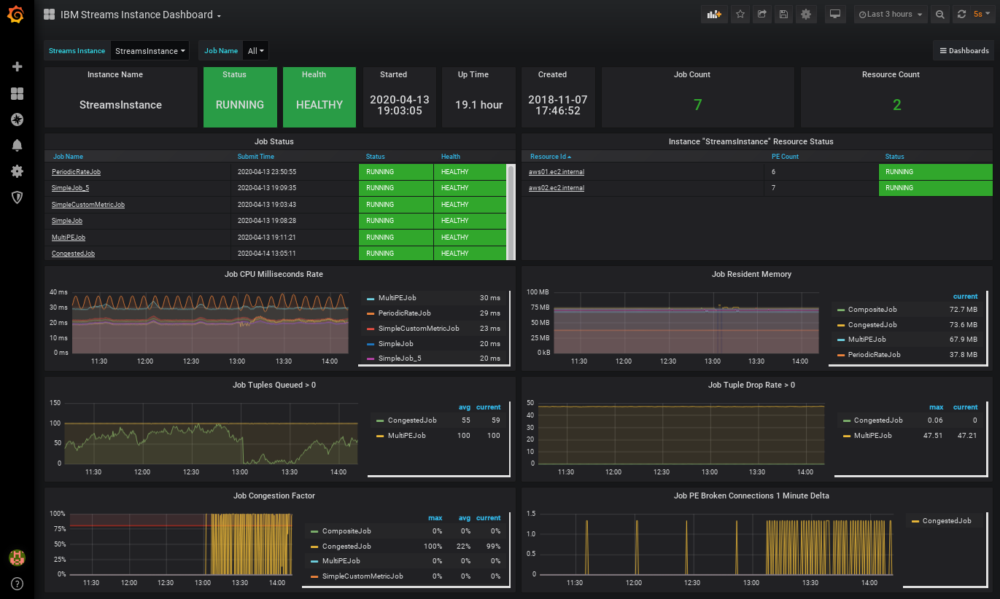

# streams-metric-exporter

Prometheus Metrics Exporter for IBM Streams version 5.x.

**NOTE:** This version will not work with older Streams versions (e.g. 4.x).

**USAGE:** The easiest way to use the streams metric exporter is via Docker Container: https://hub.docker.com/r/bmwilli1/streams-metric-exporter

IBM Streams provides a JMX Service (with HTTP GET interface for batch metric pulls) that is capable of providing status of the Streams instance, deployed streaming applications (jobs), and cluster resources.  In addition, user defined custom metrics are available via the Streams JMX Service without any additional configuration.

The primary use-case for this application is as a Prometheus metrics exporter to provide time series displays using Grafana.

This application is **optimized** for better performance over per-job metric scraping approaches.  The metrics and snapshots are pulled from IBM Streams for all jobs at the same time. The pulls from IBM Streams can be performed whenever the rest endpoint (/metrics) is requested or scheduled to be pulled and cached with a configurable interval (``--refresh``).

The service can be configured with periodic refresh (refresh rate > 0) or on-demand refresh (refresh rate == 0) when the HTTP/HTTPS endpoints are accessed.

The REST service supports HTTP and HTTPS with One-way SSL Authentication.

## Questions

For questions and issues, please contact:

Brian M Williams, IBM<br>
bmwilli@us.ibm.com

# Contents

1. [Running in OpenShift with Cloud Pak for Data](#running-in-openshift-with-cloud-pak-for-data)
2. [Prometheus Integration](#prometheus-integration)
3. [Grafana Sample Dashboards](#grafana-sample-dashboards)
4. [Running from command line](#running-from-command-line)
5. [Command line options](#command-line-options)
6. [JMX Connection Failover](#jmx-connection-failover)
7. [Logging](#logging)
8. [Redirecting JMX HTTP URLs](#redirecting-jmx-http-urls)
9. [Running in Docker](#running-in-docker)
10. [REST endpoints](#rest-endpoints)
11. [Building streams-metric-exporter](#building-the-application)


# Running in OpenShift with Cloud Pak for Data

IBM Streams 5 is typically run as part of IBM Cloud Pak for Data.  There are many ways to accomplish to goal of running streams-metric-exporter in CP4D.  Below are two examples to get started, however, in a
production environment you may want to create a more complex template which hides credentials in secrets.

## Prerequisites

* IBM Cloud Pak for Data (CP4D) (tested with 2.5.0) Instance
* IBM Streams Add-on installed in CP4D
* IBM Streams Instance deployed in CP4D
* CP4D User (e.g. streamsmetricuser) with permissions:
  * CP4D User Role: minimum privilege of "Access catalog" (e.g. "Developer" role)
  * CP4D Streams Instance Access to read all of the jobs they are to monitor

## Information Required

Collection information required for streams-metric-exporter environment variables

| Environment Variable | Details |
| :----------------- | :---------- |
| **STREAMS_INSTANCE_ID** | Name of Streams Instance provisioned in CP4D (e.g. stream1) |
| **STREAMS_EXPORTER_JMXCONNECT** | Service JMX endpoint found under "view details" of Streams Instance |
| **STREAMS_EXPORTER_USERNAME** | Name of CP4D user described in prerequisites |
| **STREAMS_EXPORTER_PASSWORD** | Password of CP4D user described in prerequisites |

## Streams Metric Dashboard (streams-metric-exporter, Prometheus, and Grafana)

This example will run a complete Streams Metric Dashboard solution in OpenShift with Cloud Pak for Data

1. Copy the template file to your OpenShift command host
```bash
wget https://raw.githubusercontent.com/IBMStreams/streamsx.jmxclients/v5/streams-metric-exporter/openshift/streams-metric-dashboard.yaml
```

2. Copy the sample dashboards to your OpenShift command host

```bash
wget https://raw.githubusercontent.com/IBMStreams/streamsx.jmxclients/v5/streams-metric-exporter/dashboards/IBMStreamsInstanceDashboard.json
wget https://raw.githubusercontent.com/IBMStreams/streamsx.jmxclients/v5/streams-metric-exporter/dashboards/IBMStreamsResourceDashboard.json
wget https://raw.githubusercontent.com/IBMStreams/streamsx.jmxclients/v5/streams-metric-exporter/dashboards/IBMStreamsJobDashboard.json
```

2. Create new OpenShift Project

```bash
oc new-project streams-metric-dashboard
```

3. Create a new application based on the template

```bash
oc new-app -f streams-metric-dashboard.yaml \
      -p STREAMS_EXPORTER_JMXCONNECT=service:jmx:jmxmp://stream1-jmx.zen:9975 \
      -p STREAMS_INSTANCE_ID=stream1 \
      -p STREAMS_EXPORTER_USERNAME=streamsmetricuser \
      -p STREAMS_EXPORTER_PASSWORD=passw0rd
```

4. List the routes that were created

```bash
oc get routes
```

5. Test the streams-metric-exporter route
```bash
curl streams-metric-exporter-streams-metric-dashboard.apps.my.cluster.com
```

6. Open Grafana url in a browser
   Default Username: admin
   Default Password: passw0rd

```bash
http://grafana-streams-metric-dashboard.apps.my.cluster.com
```

7. Import the sample dashboards via the Grafana GUI


## Streams Metric Exporter alone

This example will run just the streams-metric-exporter app.  This would be useful for tying into an existing Prometheus/Grafana solution

1. Create new OpenShift Project

```bash
oc new-project streams-metrics
```

3. Create new Openshift Application from Docker Image

```bash
oc new-app --bmwilli1/streams-metric-exporter:5.0.0 \
      -e STREAMS_EXPORTER_JMXCONNECT=service:jmx:jmxmp://stream1-jmx.zen:9975 \
      -e STREAMS_INSTANCE_ID=stream1 \
      -e STREAMS_EXPORTER_USERNAME=streamsmetricuser \
      -e STREAMS_EXPORTER_PASSWORD=passw0rd
```

4. Expose the new exporter service to test (optional)

```
oc expose svc/streams-metric-exporter
```

5. Get the name of the DNS entry created

```
oc describe route streams-metric-exporter
```

6. Test via curl

```
curl streams-metric-exporter-streams-metrics.apps.my.cluster.com/metrics
```

# Prometheus Integration

## Endpoint

```bash
/metrics or /prometheus
```
## prometheus.yml
This file configures how prometheus will scrape the streams-metric-exporter.

```yml
  - job_name: "ibmstreams"
    scrape_interval: "10s"
    metrics_path: "/metrics"
    static_configs:
    - targets: ['localhost:25500']
```
## Metric Names
The exact set of metric names exposed is a mix of static and dynamically named metrics.
The metric names chosen for this endpoint are a hybrid of prometheus naming conventions and the pre-defined metrics of IBMStreams.
Metric prefixes are static and based on which Streams objects the metrics are produced for.

The pattern for metric names is<br>

```streams_<objecttype>[_<subobjecttype>]_[_<aggregationtype>]_<streams metric>```

Examples
```
streams_operator_ip_nTuplesProcessed
streams_job_max_congestionFactor
streams_operator_myCustomMetric
```

| Metric Name Prefix | Description |
| :----------------- | :---------- |
| **streams_domain_**|domain level metrics and status|
| **streams_instance_**|instance level metrics and status|
| **streams_resource_**|streams resource metrics|
| **streams_job_**|streams job metrics|
| **streams_pe_**|streams pe metrics|
| **streams_pe_ip_**|streams pe input port metrics|
| **streams_pe_op_**|streams pe output port metrics|
| **streams_pe_op_connection_**|streams pe output port connection metrics|
| **streams_operator_**|streams operator metrics<br>**Includes custom metrics**|
| **streams_operator_ip_**|streams operator input port metrics|
| **streams_operator_op_**|streams operatore output port metrics|

### Sanitization
Metric names are sanitized (fixed) to meet Prometheus naming conventions.  This is usually not required for 99% of IBM Streams metrics, however, since IBM Streams allows special characters and white space in metric names the following conversion rules are implemented:

* Replace series of one or more whitespaces with underscore (_)
* Remove any special characters

An example would be the metric "streams_operator_nItemsQueued (port 2)" would become "streams_operator_nItemsQueued_port_2"

## Metric Labels
The prometheus metric names are not specific to streams objects (e.g. a specific job), rather, they are for an object type (e.g. operator input port).  The labels are used to identify the individual instances (e.g. job: job_1, operator: myBeacon, input port: StockTickersIn).
Note: the streams-metric-exporter resolves operator input and output ports to names rather than indexes.  This is easier for use in queries.

| Label Name | Description     |
| :------------- | :------------- |
|**domainname**|name of the streams domain
|**instancename**|name of streams instance (instance is reserved by prometheus)|
|**jobname**| name of streams job (job is reserved by prometheus)|
|**operatorname**| name of operator|
|**operatorkind**| kind of operator (e.g. spl.relational::Functor)
|**inputportname**| name of input port|
|**outputportname**| name of output port|
|**resource**| name of streams resource|
|**peid**|id of streams processing element|
|**index**|index of pe input or output port|
|**connectionid**|connection id of streams pe output port connection|

## Prometheus endpoint example metrics

```
# HELP streams_domain_instanceCount Number of instances currently created in the streams domain
# TYPE streams_domain_instanceCount gauge
streams_domain_instanceCount{domainname="StreamsDomain",} 2.0

# HELP streams_instance_jobCount Number of jobs currently deployed into the streams instance
# TYPE streams_instance_jobCount gauge
streams_instance_jobCount{domainname="StreamsDomain",instancename="StreamsInstance",} 1.0

# HELP streams_job_pecount Number of pes deployed for this job
# TYPE streams_job_pecount gauge
streams_job_pecount{domainname="StreamsDomain",instancename="StreamsInstance",jobname="MultiPEJob",} 2.0

# HELP streams_operator_ip_nTuplesProcessed Streams operator input port metric: nTuplesProcessed
# TYPE streams_operator_ip_nTuplesProcessed gauge
streams_operator_ip_nTuplesProcessed{domainname="StreamsDomain",instancename="StreamsInstance",jobname="MultiPEJob",resource="streamsqse",peid="1",operatorname="FilterStream",operatorkind="spl.relational.Filter",inputportname="BeaconStream",} 675632.0

# HELP streams_pe_op_connection_congestionFactor Streams pe output port connection metric: congestionFactor
# TYPE streams_pe_op_connection_congestionFactor gauge
streams_pe_op_connection_congestionFactor{domainname="StreamsDomain",instancename="StreamsInstance",jobname="MultiPEJob",resource="streamsqse",peid="1",index="0",connectionid="o0p1i0p0",} 0.0
```

# Grafana Sample Dashboards
See [dashboards directory](dashboards/README.md) for more information.




# Running from Command Line
```
java -jar target/executable-streams-metric-exporter.jar -j \
service:jmx:jmxmp://localhost:9975 -i StreamsInstance -u streamsadmin

password: <enter streamsadmin password>
```


# Command line options
`java -jar target/executable-streams-metric-exporter.jar --help`

<pre>
Usage: streams-metric-exporter [options]
  Options:
    --help
      Display command line arguments
      Default: false
    -h, --host
      Listen Host or IP address for this service (e.g. localhost)
      Environment Variable: STREAMS_EXPORTER_HOST
      Default: localhost
    -i, --instance
      Streams instance name.  Only used if Instance List not provided.
      Environment Variable: STREAMS_INSTANCE_ID
      Default: stream1
    --jmxhttphost
      Host or IP used to replace jmx http large data set URL host fields.  Not usually needed. Use with caution.      Environment
      Variable: STREAMS_EXPORTER_JMX_HTTP_HOST
    --jmxhttpport
      Port used to replace jmx http large data set URL port fields.  Not usually needed. Use with caution.      Environment
      Variable: STREAMS_EXPORTER_JMX_HTTP_PORT
      Default: 31819
    --jmxssloption
      SSL Option for connection to Streams JMX Server (e.g. SSL_TLSv2, TSLv1.1, TLSv1.2)
      Environment Variable:
      STREAMS_EXPORTER_JMX_SSLOPTION
      Default: TLSv1.2
    --jmxtruststore
      Java keystore of certificates/signers to trust from JMX Server
      Environment Variable: STREAMS_EXPORTER_JMX_TRUSTSTORE
    -j, --jmxurl
      JMX Connection URL (e.g. service:jmx:jmxmp://localhost:9975). Supports comma-separated list for failover.
      Environment
      Variable: STREAMS_EXPORTER_JMXCONNECT
      Default: service:jmx:jmxmp://10.75.16.206:32399
    --logdir
      Logging direcotry.  If not set or empty log to stdout.
     Environment Variable: STREAMS_EXPORTER_LOGDIR
      Default: 
    -l, --loglevel
      Logging level [ fatal | error | warn | info | debug | trace ]
      Environment Variable: STREAMS_EXPORTER_LOGLEVEL
      Default: info
    --noconsole
      Flag to indicate not to prompt for password (can still redirect from stdin or use environment variable for password.
      Default: false
    --password
      Streams login password. Recommend using environment variable
      Environment Variable: STREAMS_EXPORTER_PASSWORD
      Default: ou812bmw
    -p, --port
      Listen Port for this service
      Environment Variable: STREAMS_EXPORTER_PORT
      Default: 25500
    -r, --refresh
      Refresh rate of metrics in seconds or 0 for no automatic refresh
      Environment Variable: STREAMS_EXPORTER_REFRESHRATE
      Default: 0
    --serverkeystore
      Java keystore containing server certificate and key to identify server side of this application
      Environment Variable:
      STREAMS_EXPORTER_SERVER_KEYSTORE
    --serverkeystorepwd
      Passphrase to java keystore.  Passphrase of keystore and key (if it has one) must match
      Environment Variable:
      STREAMS_EXPORTER_SERVER_KEYSTORE_PWD
    --serverprotocol
      http or https.  https will use one-way ssl authentication and java default for tls level (TLSv1.2)
      Environment
      Variable: STREAMS_EXPORTER_SERVER_PROTOCOL
      Default: http
    -u, --user
      Streams login username. Use this or X509CERT
      Environment Variable: STREAMS_EXPORTER_USERNAME
      Default: bmwilli
    -v, --version
      Display version information
      Default: false
    --webPath,
      Base URI prefix (e.g. /someprefix)
      Environment Variable: STREAMS_EXPORTER_WEBPATH
      Default: /
    -x, --x509cert
      X509 Certificate file to use instead of username/password
      Environment Variable: STREAMS_X509CERT
</pre>


# JMX Connection Failover
The ``-j|--jmxurl`` option accepts a comma separated list of jmx connection urls.<br> 
Example: ```service:jmx:jmxmp://host1:9975,service:jmx:jmxmp://host2:9975```<br>
When attempting a connection to the jmx server, each of these will be tried in order without delay.
If a list is provided and a connection cannot be made to any of the url's in the list, then an exception
may be raised and normal delay / retry logic used.  The connection acquired will stay active until it is lost.  At that time, the list will be retried from the beginning.

# Logging
Logging is performed through the log4j 1.2 facility. There are two arguments to control logging.

| argument | env | default | description |
|:---------|:----|:--------|:------------|
|--logdir|STREAM_EXPORTER_LOGDIR|undefined<br>(stdout)|If this argument is undefined log messages are sent to the **console** (stdout).<br>If this argument is present then a rolling logfile is created in the directory specified with the name of the logfile: **StreamsMetricExporter.log**|
|--loglevel|STREAMS_EXPORTER_LOGLEVEL|info|fatal,error,warn,info,debug,trace<br>**note:** debug level contains timing messages|


## Adding to the default logging
If you wish to configure your own logging (in addition to that which the application already does), create a log4j.properties file and point to it using the log4j.configuration java property.  For example:
```
java -Dlog4j.configuration=file:${PWD}/log4j.properties -jar target/executable-streams-metric-exporter.jar -j \
service:jmx:jmxmp://localhost:9975 -d StreamsDomain -i \
StreamsInstance -u streamsadmin
```
This would be useful in situations when you want to log to both the console and a file.<br>
**Note:** The log level will still be set by the command line argument or environment variable, NOT the rootlogger value in your log4j.properties.

# Redirecting JMX HTTP URLs
There are some configurations where you will need to override the URLs returned for large data sets to be pulled from IBM Streams over Http.
<br>
There are two arguments that can be used to overwrite the JMX Http URL that is used for large data objects.

| argument | env | default | description |
|:---------|:----|:--------|:------------|
|--jmxhttphost|STREAM_EXPORTER_JMX_HTTP_HOST|undefined|Host name or IP Address<br>If this argument is specified the host field of the JMX Http URL will be replaced with this value|
|--jmxhttpport|STREAMS_EXPORTER_JMX_HTTP_PORT|undefined|Port number<br>If this argument is specified the port field of the JMX Http URL will be replaced with this value|


## JMX HTTP Host and Port redirection examples and Kubernetes
IBM Streams JMX API has several calls that return urls that are to be used by an HTTP Get request to pull back large data items.  Examples used in this application include: `snapshotJobMetrics()` and `snapshotJobs()`.

The default configuration of IBM Streams uses a random port for the JMX Http Server.  To override this and set a specific port set the following IBM Streams properties:

| Streams Version | Property Type | Property |
|:----------------|:--------------|:---------|
| 4.2.1.3 & earlier | Instance | sam.jmxHttpPort |
| 4.2.4 & later | Domain | jmx.httpPort |

In cases where the Streams JMX Server is running inside of a container or environment with private IP addresses and a gateway, the URLs returned from these calls will use the host and port of the internal address of the JMX Http Port.  In addition, the default configuration of Streams will use a random port at startup for the JMX Http Server.

Using the `--jmxhttphost` and `--jmxhttpport` arguments or environment variables an be used to override the URL before the HTTP Get request is performed.

Logging at the `debug` level will provide messages showing thge URLs before and after the override.

When Streams metric export is running outside of the Kubernetes/OpenShift cluster hosting Streams, Kubernetes Service Objects and OpenShift routes are used to map external facing hostnames and ports to internal pod hosts (ip address) and ports.  The JMX HTTP Host and Port override arguments can be used to get around this issue.  Provide the Kubernetes external cluster hostname and the NodePort of the service or the OpenShift Route DNS name as the arguments for Streams Metric Exporter.


# Running in Docker

Streams Metric Exporter can be run outside of the kubernetes hosting Streams 5, however, you will need to expose the Streams JMX Service as a NodePort Service object. Included in this release is a docker-compose.yml file for starting it up with Prometheus and Grafana instances.

The versions of Prometheus and Grafana specified in the docker-compose.yml file are those that were used for testing.

## Prerequisites

* Compiled version of Streams Metric Exporter (executable-streams-metric-exporter.jar)
* JMX Access to a running IBM Streams 4.2.1 Domain (JMX Port 9975 is the default)
* Docker Engine (version 17.05.0.ce used in development)
* Docker Compose (version 1.9.0-5 with .yml file format 2 used in development)
* Access to Dockerhub or local repository with Images:
  * ibmjava:sfj-alpine (or any 1.8 version)
  * prom/prometheus (2.x or higher)
  * grafana/grafana (5.x or higher)

## Setup environment

1. Change to the docker directory in this project<br>
```bash
cd docker
```
2. Create .env file from sample.env
```
cp sample.env .env
```
3. Edit .env to set authentication for streams jmx Server
```
STREAMS_EXPORTER_USERNAME=<username with domain/instance read access>
STREAMS_EXPORTER_PASSWORD=<user password for pam authentication>
```
4. Export additional environment variables via .env file or from the command line
```
export STREAMS_EXPORTER_JMXCONNECT=service:jmx:jmxmp://<jmxhost>:<jmxport>
export STREAMS_DOMAIN_ID=<domain id>
```
5. Build / Run Docker Images
```
docker-compose build
docker-compose up
```
6. Open Grafana in browswer
```
http://localhost:3000
```
7. Login with default username/password
```
admin/admin
```
8. Navigate to Home Dashboard
```
IBM Streams Sample Dashboard
```
9. View raw metrics output from /prometheus endpoint
```
http://localhost:25500/prometheus
```
10. Query the prometheus ui
```
http://localhost:9090
```


# REST endpoints

## /metrics (or /prometheus)
Retrieve the prometheus format of the metrics

<details>
  <summary><code>curl http://localhost:25500/metrics</code></summary>
<pre>
# HELP streams_job_healthy DEPRECTED: Use helath: Job health, set to 1 of job is healthy else 0
# TYPE streams_job_healthy gauge
streams_job_healthy{instancename="stream1",jobname="HelloWorld_1",} 1.0
streams_job_healthy{instancename="stream1",jobname="PeriodicRateJob_6",} 1.0
# HELP streams_resource_memoryFree Streams resource metric: memoryFree
# TYPE streams_resource_memoryFree gauge
streams_resource_memoryFree{instancename="stream1",resource="repository-0",} 0.0
streams_resource_memoryFree{instancename="stream1",resource="security-0",} 0.0
streams_resource_memoryFree{instancename="stream1",resource="console-0",} 0.0
streams_resource_memoryFree{instancename="stream1",resource="app-14",} 0.0
streams_resource_memoryFree{instancename="stream1",resource="management-0",} 0.0
streams_resource_memoryFree{instancename="stream1",resource="app-1",} 0.0
# HELP streams_operator_relativeOperatorCost Streams operator metric: relativeOperatorCost
# TYPE streams_operator_relativeOperatorCost gauge
streams_operator_relativeOperatorCost{instancename="stream1",jobname="HelloWorld_1",resource="app-1",peid="1",operatorname="DataStream",operatorkind="spl.utility::Beacon",} 100.0
streams_operator_relativeOperatorCost{instancename="stream1",jobname="PeriodicRateJob_6",resource="app-14",peid="6",operatorname="DataSource",operatorkind="spl.utility::Custom",} 100.0
streams_operator_relativeOperatorCost{instancename="stream1",jobname="PeriodicRateJob_6",resource="app-14",peid="6",operatorname="Sink",operatorkind="spl.utility::Custom",} 0.0
streams_operator_relativeOperatorCost{instancename="stream1",jobname="HelloWorld_1",resource="app-1",peid="1",operatorname="Sink",operatorkind="spl.utility::Custom",} 0.0
# HELP streams_job_submitTime Epoch time in milliseconds when job was submitted
# TYPE streams_job_submitTime gauge
streams_job_submitTime{instancename="stream1",jobname="HelloWorld_1",} 1.586379252E12
streams_job_submitTime{instancename="stream1",jobname="PeriodicRateJob_6",} 1.58712268E12
# HELP streams_pe_nMemoryConsumption Streams pe metric: nMemoryConsumption
# TYPE streams_pe_nMemoryConsumption gauge
streams_pe_nMemoryConsumption{instancename="stream1",jobname="PeriodicRateJob_6",resource="app-14",peid="6",} 713020.0
streams_pe_nMemoryConsumption{instancename="stream1",jobname="HelloWorld_1",resource="app-1",peid="1",} 565520.0
# HELP streams_operator_ip_queueSize Streams operator input port metric: queueSize
# TYPE streams_operator_ip_queueSize gauge
streams_operator_ip_queueSize{instancename="stream1",jobname="PeriodicRateJob_6",resource="app-14",peid="6",operatorname="Sink",operatorkind="spl.utility::Custom",inputportname="In",} 0.0
streams_operator_ip_queueSize{instancename="stream1",jobname="HelloWorld_1",resource="app-1",peid="1",operatorname="Sink",operatorkind="spl.utility::Custom",inputportname="DataStream",} 0.0
# HELP streams_resource_cpuRequest Streams resource metric: cpuRequest
# TYPE streams_resource_cpuRequest gauge
streams_resource_cpuRequest{instancename="stream1",resource="repository-0",} 1.0
streams_resource_cpuRequest{instancename="stream1",resource="security-0",} 2.0
streams_resource_cpuRequest{instancename="stream1",resource="console-0",} 1.0
streams_resource_cpuRequest{instancename="stream1",resource="app-14",} 1.0
streams_resource_cpuRequest{instancename="stream1",resource="management-0",} 2.0
streams_resource_cpuRequest{instancename="stream1",resource="app-1",} 1.0
# HELP streams_instance_jobCount Number of jobs currently deployed into the streams instance
# TYPE streams_instance_jobCount gauge
streams_instance_jobCount{instancename="stream1",} 2.0
# HELP streams_job_health Job health, 1: healthy, .5: partially healthy, 0: unhealthy, unknown
# TYPE streams_job_health gauge
streams_job_health{instancename="stream1",jobname="HelloWorld_1",} 1.0
streams_job_health{instancename="stream1",jobname="PeriodicRateJob_6",} 1.0
# HELP streams_operator_ip_nTuplesProcessed Streams operator input port metric: nTuplesProcessed
# TYPE streams_operator_ip_nTuplesProcessed gauge
streams_operator_ip_nTuplesProcessed{instancename="stream1",jobname="PeriodicRateJob_6",resource="app-14",peid="6",operatorname="Sink",operatorkind="spl.utility::Custom",inputportname="In",} 1.93789224E9
streams_operator_ip_nTuplesProcessed{instancename="stream1",jobname="HelloWorld_1",resource="app-1",peid="1",operatorname="Sink",operatorkind="spl.utility::Custom",inputportname="DataStream",} 3081045.0
# HELP streams_operator_ip_recentMaxItemsQueued Streams operator input port metric: recentMaxItemsQueued
# TYPE streams_operator_ip_recentMaxItemsQueued gauge
streams_operator_ip_recentMaxItemsQueued{instancename="stream1",jobname="PeriodicRateJob_6",resource="app-14",peid="6",operatorname="Sink",operatorkind="spl.utility::Custom",inputportname="In",} 0.0
streams_operator_ip_recentMaxItemsQueued{instancename="stream1",jobname="HelloWorld_1",resource="app-1",peid="1",operatorname="Sink",operatorkind="spl.utility::Custom",inputportname="DataStream",} 0.0
# HELP streams_resource_cpuUtilization Streams resource metric: cpuUtilization
# TYPE streams_resource_cpuUtilization gauge
streams_resource_cpuUtilization{instancename="stream1",resource="repository-0",} 0.0
streams_resource_cpuUtilization{instancename="stream1",resource="security-0",} 0.0
streams_resource_cpuUtilization{instancename="stream1",resource="console-0",} 0.0
streams_resource_cpuUtilization{instancename="stream1",resource="app-14",} 0.0
streams_resource_cpuUtilization{instancename="stream1",resource="management-0",} 0.0
streams_resource_cpuUtilization{instancename="stream1",resource="app-1",} 0.0
# HELP streams_resource_status Streams resource metric: status
# TYPE streams_resource_status gauge
streams_resource_status{instancename="stream1",resource="repository-0",} 1.0
streams_resource_status{instancename="stream1",resource="security-0",} 1.0
streams_resource_status{instancename="stream1",resource="console-0",} 1.0
streams_resource_status{instancename="stream1",resource="app-14",} 1.0
streams_resource_status{instancename="stream1",resource="management-0",} 1.0
streams_resource_status{instancename="stream1",resource="app-1",} 1.0
# HELP streams_job_status Streams job metric: status
# TYPE streams_job_status gauge
streams_job_status{instancename="stream1",jobname="HelloWorld_1",} 1.0
streams_job_status{instancename="stream1",jobname="PeriodicRateJob_6",} 1.0
# HELP streams_job_max_congestionFactor Maximum of all pe connection metric: congestionFactor
# TYPE streams_job_max_congestionFactor gauge
streams_job_max_congestionFactor{instancename="stream1",jobname="HelloWorld_1",} 0.0
streams_job_max_congestionFactor{instancename="stream1",jobname="PeriodicRateJob_6",} 0.0
# HELP streams_job_min_congestionFactor Minimum of all pe connection metric: congestionFactor
# TYPE streams_job_min_congestionFactor gauge
streams_job_min_congestionFactor{instancename="stream1",jobname="HelloWorld_1",} 0.0
streams_job_min_congestionFactor{instancename="stream1",jobname="PeriodicRateJob_6",} 0.0
# HELP streams_operator_ip_recentMaxItemsQueuedInterval Streams operator input port metric: recentMaxItemsQueuedInterval
# TYPE streams_operator_ip_recentMaxItemsQueuedInterval gauge
streams_operator_ip_recentMaxItemsQueuedInterval{instancename="stream1",jobname="PeriodicRateJob_6",resource="app-14",peid="6",operatorname="Sink",operatorkind="spl.utility::Custom",inputportname="In",} 0.0
streams_operator_ip_recentMaxItemsQueuedInterval{instancename="stream1",jobname="HelloWorld_1",resource="app-1",peid="1",operatorname="Sink",operatorkind="spl.utility::Custom",inputportname="DataStream",} 0.0
# HELP streams_resource_memoryLimit Streams resource metric: memoryLimit
# TYPE streams_resource_memoryLimit gauge
streams_resource_memoryLimit{instancename="stream1",resource="repository-0",} 2000000.0
streams_resource_memoryLimit{instancename="stream1",resource="security-0",} 4000000.0
streams_resource_memoryLimit{instancename="stream1",resource="console-0",} 6000000.0
streams_resource_memoryLimit{instancename="stream1",resource="app-14",} 2000000.0
streams_resource_memoryLimit{instancename="stream1",resource="management-0",} 8000000.0
streams_resource_memoryLimit{instancename="stream1",resource="app-1",} 2000000.0
# HELP streams_pe_launchCount Streams pe metric: launchCount
# TYPE streams_pe_launchCount gauge
streams_pe_launchCount{instancename="stream1",jobname="PeriodicRateJob_6",resource="app-14",peid="6",} 1.0
streams_pe_launchCount{instancename="stream1",jobname="HelloWorld_1",resource="app-1",peid="1",} 1.0
# HELP streams_operator_ip_nFinalPunctsQueued Streams operator input port metric: nFinalPunctsQueued
# TYPE streams_operator_ip_nFinalPunctsQueued gauge
streams_operator_ip_nFinalPunctsQueued{instancename="stream1",jobname="PeriodicRateJob_6",resource="app-14",peid="6",operatorname="Sink",operatorkind="spl.utility::Custom",inputportname="In",} 0.0
streams_operator_ip_nFinalPunctsQueued{instancename="stream1",jobname="HelloWorld_1",resource="app-1",peid="1",operatorname="Sink",operatorkind="spl.utility::Custom",inputportname="DataStream",} 0.0
# HELP streams_resource_role Streams resource role: role
# TYPE streams_resource_role gauge
streams_resource_role{instancename="stream1",resource="repository-0",role="service",} 1.0
streams_resource_role{instancename="stream1",resource="security-0",role="service",} 1.0
streams_resource_role{instancename="stream1",resource="console-0",role="service",} 1.0
streams_resource_role{instancename="stream1",resource="management-0",role="service",} 1.0
streams_resource_role{instancename="stream1",resource="app-1",role="application",} 1.0
streams_resource_role{instancename="stream1",resource="app-14",role="application",} 1.0
# HELP streams_operator_ip_nWindowPunctsQueued Streams operator input port metric: nWindowPunctsQueued
# TYPE streams_operator_ip_nWindowPunctsQueued gauge
streams_operator_ip_nWindowPunctsQueued{instancename="stream1",jobname="PeriodicRateJob_6",resource="app-14",peid="6",operatorname="Sink",operatorkind="spl.utility::Custom",inputportname="In",} 0.0
streams_operator_ip_nWindowPunctsQueued{instancename="stream1",jobname="HelloWorld_1",resource="app-1",peid="1",operatorname="Sink",operatorkind="spl.utility::Custom",inputportname="DataStream",} 0.0
# HELP streams_instance_status Instance status, 1: running, .5: partially up, 0: stopped, failed, unknown
# TYPE streams_instance_status gauge
streams_instance_status{instancename="stream1",} 1.0
# HELP streams_resource_nProcessors Streams resource metric: nProcessors
# TYPE streams_resource_nProcessors gauge
streams_resource_nProcessors{instancename="stream1",resource="repository-0",} 1.0
streams_resource_nProcessors{instancename="stream1",resource="security-0",} 2.0
streams_resource_nProcessors{instancename="stream1",resource="console-0",} 1.0
streams_resource_nProcessors{instancename="stream1",resource="app-14",} 1.0
streams_resource_nProcessors{instancename="stream1",resource="management-0",} 2.0
streams_resource_nProcessors{instancename="stream1",resource="app-1",} 1.0
# HELP streams_operator_ip_nFinalPunctsProcessed Streams operator input port metric: nFinalPunctsProcessed
# TYPE streams_operator_ip_nFinalPunctsProcessed gauge
streams_operator_ip_nFinalPunctsProcessed{instancename="stream1",jobname="PeriodicRateJob_6",resource="app-14",peid="6",operatorname="Sink",operatorkind="spl.utility::Custom",inputportname="In",} 0.0
streams_operator_ip_nFinalPunctsProcessed{instancename="stream1",jobname="HelloWorld_1",resource="app-1",peid="1",operatorname="Sink",operatorkind="spl.utility::Custom",inputportname="DataStream",} 0.0
# HELP streams_operator_op_nFinalPunctsSubmitted Streams metric: nFinalPunctsSubmitted
# TYPE streams_operator_op_nFinalPunctsSubmitted gauge
streams_operator_op_nFinalPunctsSubmitted{instancename="stream1",jobname="HelloWorld_1",resource="app-1",peid="1",operatorname="DataStream",operatorkind="spl.utility::Beacon",outputportname="DataStream",} 0.0
streams_operator_op_nFinalPunctsSubmitted{instancename="stream1",jobname="PeriodicRateJob_6",resource="app-14",peid="6",operatorname="DataSource",operatorkind="spl.utility::Custom",outputportname="DataSource",} 0.0
# HELP streams_resource_cpuUsed Streams resource metric: cpuUsed
# TYPE streams_resource_cpuUsed gauge
streams_resource_cpuUsed{instancename="stream1",resource="repository-0",} 0.0
streams_resource_cpuUsed{instancename="stream1",resource="security-0",} 0.0
streams_resource_cpuUsed{instancename="stream1",resource="console-0",} 0.0
streams_resource_cpuUsed{instancename="stream1",resource="app-14",} 0.0
streams_resource_cpuUsed{instancename="stream1",resource="management-0",} 0.0
streams_resource_cpuUsed{instancename="stream1",resource="app-1",} 0.0
# HELP streams_job_nMemoryConsumption Sum of each pe metric: nMemoryConsumption
# TYPE streams_job_nMemoryConsumption gauge
streams_job_nMemoryConsumption{instancename="stream1",jobname="HelloWorld_1",} 565520.0
streams_job_nMemoryConsumption{instancename="stream1",jobname="PeriodicRateJob_6",} 713020.0
# HELP streams_operator_ip_nWindowPunctsProcessed Streams operator input port metric: nWindowPunctsProcessed
# TYPE streams_operator_ip_nWindowPunctsProcessed gauge
streams_operator_ip_nWindowPunctsProcessed{instancename="stream1",jobname="PeriodicRateJob_6",resource="app-14",peid="6",operatorname="Sink",operatorkind="spl.utility::Custom",inputportname="In",} 0.0
streams_operator_ip_nWindowPunctsProcessed{instancename="stream1",jobname="HelloWorld_1",resource="app-1",peid="1",operatorname="Sink",operatorkind="spl.utility::Custom",inputportname="DataStream",} 0.0
# HELP streams_resource_memoryUtilization Streams resource metric: memoryUtilization
# TYPE streams_resource_memoryUtilization gauge
streams_resource_memoryUtilization{instancename="stream1",resource="repository-0",} 0.0
streams_resource_memoryUtilization{instancename="stream1",resource="security-0",} 0.0
streams_resource_memoryUtilization{instancename="stream1",resource="console-0",} 0.0
streams_resource_memoryUtilization{instancename="stream1",resource="app-14",} 0.0
streams_resource_memoryUtilization{instancename="stream1",resource="management-0",} 0.0
streams_resource_memoryUtilization{instancename="stream1",resource="app-1",} 0.0
# HELP streams_resource_cpuLimit Streams resource metric: cpuLimit
# TYPE streams_resource_cpuLimit gauge
streams_resource_cpuLimit{instancename="stream1",resource="repository-0",} 1.0
streams_resource_cpuLimit{instancename="stream1",resource="security-0",} 4.0
streams_resource_cpuLimit{instancename="stream1",resource="console-0",} 2.0
streams_resource_cpuLimit{instancename="stream1",resource="app-14",} 2.0
streams_resource_cpuLimit{instancename="stream1",resource="management-0",} 12.0
streams_resource_cpuLimit{instancename="stream1",resource="app-1",} 2.0
# HELP streams_job_nResidentMemoryConsumption Sum of each pe metric: nResidentMemoryConsumption
# TYPE streams_job_nResidentMemoryConsumption gauge
streams_job_nResidentMemoryConsumption{instancename="stream1",jobname="HelloWorld_1",} 26300.0
streams_job_nResidentMemoryConsumption{instancename="stream1",jobname="PeriodicRateJob_6",} 26324.0
# HELP streams_pe_health Streams pe metric: health
# TYPE streams_pe_health gauge
streams_pe_health{instancename="stream1",jobname="PeriodicRateJob_6",resource="app-14",peid="6",} 1.0
streams_pe_health{instancename="stream1",jobname="HelloWorld_1",resource="app-1",peid="1",} 1.0
# HELP streams_job_pecount Number of pes deployed for this job
# TYPE streams_job_pecount gauge
streams_job_pecount{instancename="stream1",jobname="HelloWorld_1",} 1.0
streams_job_pecount{instancename="stream1",jobname="PeriodicRateJob_6",} 1.0
# HELP streams_job_sum_congestionFactor Sum of each pe metric: congestionFactor (no value used by itself
# TYPE streams_job_sum_congestionFactor gauge
streams_job_sum_congestionFactor{instancename="stream1",jobname="HelloWorld_1",} 0.0
streams_job_sum_congestionFactor{instancename="stream1",jobname="PeriodicRateJob_6",} 0.0
# HELP streams_instance_health Instance health, 1: healthy, .5: partially healthy, 0: unhealthy, unknown
# TYPE streams_instance_health gauge
streams_instance_health{instancename="stream1",} 1.0
# HELP streams_pe_status Streams pe metric: status
# TYPE streams_pe_status gauge
streams_pe_status{instancename="stream1",jobname="PeriodicRateJob_6",resource="app-14",peid="6",} 1.0
streams_pe_status{instancename="stream1",jobname="HelloWorld_1",resource="app-1",peid="1",} 1.0
# HELP streams_resource_memoryTotal Streams resource metric: memoryTotal
# TYPE streams_resource_memoryTotal gauge
streams_resource_memoryTotal{instancename="stream1",resource="repository-0",} 2000000.0
streams_resource_memoryTotal{instancename="stream1",resource="security-0",} 2000000.0
streams_resource_memoryTotal{instancename="stream1",resource="console-0",} 4000000.0
streams_resource_memoryTotal{instancename="stream1",resource="app-14",} 1000000.0
streams_resource_memoryTotal{instancename="stream1",resource="management-0",} 4000000.0
streams_resource_memoryTotal{instancename="stream1",resource="app-1",} 1000000.0
# HELP streams_resource_memoryUsed Streams resource metric: memoryUsed
# TYPE streams_resource_memoryUsed gauge
streams_resource_memoryUsed{instancename="stream1",resource="repository-0",} 0.0
streams_resource_memoryUsed{instancename="stream1",resource="security-0",} 0.0
streams_resource_memoryUsed{instancename="stream1",resource="console-0",} 0.0
streams_resource_memoryUsed{instancename="stream1",resource="app-14",} 0.0
streams_resource_memoryUsed{instancename="stream1",resource="management-0",} 0.0
streams_resource_memoryUsed{instancename="stream1",resource="app-1",} 0.0
# HELP streams_resource_networkReceive Streams resource metric: networkReceive
# TYPE streams_resource_networkReceive gauge
streams_resource_networkReceive{instancename="stream1",resource="repository-0",} 0.0
streams_resource_networkReceive{instancename="stream1",resource="security-0",} 0.0
streams_resource_networkReceive{instancename="stream1",resource="console-0",} 0.0
streams_resource_networkReceive{instancename="stream1",resource="app-14",} 0.0
streams_resource_networkReceive{instancename="stream1",resource="management-0",} 0.0
streams_resource_networkReceive{instancename="stream1",resource="app-1",} 0.0
# HELP streams_operator_ip_nTuplesQueued Streams operator input port metric: nTuplesQueued
# TYPE streams_operator_ip_nTuplesQueued gauge
streams_operator_ip_nTuplesQueued{instancename="stream1",jobname="PeriodicRateJob_6",resource="app-14",peid="6",operatorname="Sink",operatorkind="spl.utility::Custom",inputportname="In",} 0.0
streams_operator_ip_nTuplesQueued{instancename="stream1",jobname="HelloWorld_1",resource="app-1",peid="1",operatorname="Sink",operatorkind="spl.utility::Custom",inputportname="DataStream",} 0.0
# HELP streams_resource_networkSpeed Streams resource metric: networkSpeed
# TYPE streams_resource_networkSpeed gauge
streams_resource_networkSpeed{instancename="stream1",resource="repository-0",} 10000.0
streams_resource_networkSpeed{instancename="stream1",resource="security-0",} 10000.0
streams_resource_networkSpeed{instancename="stream1",resource="console-0",} 10000.0
streams_resource_networkSpeed{instancename="stream1",resource="app-14",} 10000.0
streams_resource_networkSpeed{instancename="stream1",resource="management-0",} 10000.0
streams_resource_networkSpeed{instancename="stream1",resource="app-1",} 10000.0
# HELP streams_operator_ip_nTuplesDropped Streams operator input port metric: nTuplesDropped
# TYPE streams_operator_ip_nTuplesDropped gauge
streams_operator_ip_nTuplesDropped{instancename="stream1",jobname="PeriodicRateJob_6",resource="app-14",peid="6",operatorname="Sink",operatorkind="spl.utility::Custom",inputportname="In",} 0.0
streams_operator_ip_nTuplesDropped{instancename="stream1",jobname="HelloWorld_1",resource="app-1",peid="1",operatorname="Sink",operatorkind="spl.utility::Custom",inputportname="DataStream",} 0.0
# HELP streams_job_nCpuMilliseconds Sum of each pe metric: nCpuMilliseconds
# TYPE streams_job_nCpuMilliseconds gauge
streams_job_nCpuMilliseconds{instancename="stream1",jobname="HelloWorld_1",} 6116370.0
streams_job_nCpuMilliseconds{instancename="stream1",jobname="PeriodicRateJob_6",} 3.909755E7
# HELP streams_resource_networkTransmit Streams resource metric: networkTransmit
# TYPE streams_resource_networkTransmit gauge
streams_resource_networkTransmit{instancename="stream1",resource="repository-0",} 0.0
streams_resource_networkTransmit{instancename="stream1",resource="security-0",} 0.0
streams_resource_networkTransmit{instancename="stream1",resource="console-0",} 0.0
streams_resource_networkTransmit{instancename="stream1",resource="app-14",} 0.0
streams_resource_networkTransmit{instancename="stream1",resource="management-0",} 0.0
streams_resource_networkTransmit{instancename="stream1",resource="app-1",} 0.0
# HELP streams_operator_op_nWindowPunctsSubmitted Streams metric: nWindowPunctsSubmitted
# TYPE streams_operator_op_nWindowPunctsSubmitted gauge
streams_operator_op_nWindowPunctsSubmitted{instancename="stream1",jobname="HelloWorld_1",resource="app-1",peid="1",operatorname="DataStream",operatorkind="spl.utility::Beacon",outputportname="DataStream",} 0.0
streams_operator_op_nWindowPunctsSubmitted{instancename="stream1",jobname="PeriodicRateJob_6",resource="app-14",peid="6",operatorname="DataSource",operatorkind="spl.utility::Custom",outputportname="DataSource",} 0.0
# HELP streams_operator_ip_nEnqueueWaits Streams operator input port metric: nEnqueueWaits
# TYPE streams_operator_ip_nEnqueueWaits gauge
streams_operator_ip_nEnqueueWaits{instancename="stream1",jobname="PeriodicRateJob_6",resource="app-14",peid="6",operatorname="Sink",operatorkind="spl.utility::Custom",inputportname="In",} 0.0
streams_operator_ip_nEnqueueWaits{instancename="stream1",jobname="HelloWorld_1",resource="app-1",peid="1",operatorname="Sink",operatorkind="spl.utility::Custom",inputportname="DataStream",} 0.0
# HELP streams_operator_ip_maxItemsQueued Streams operator input port metric: maxItemsQueued
# TYPE streams_operator_ip_maxItemsQueued gauge
streams_operator_ip_maxItemsQueued{instancename="stream1",jobname="PeriodicRateJob_6",resource="app-14",peid="6",operatorname="Sink",operatorkind="spl.utility::Custom",inputportname="In",} 0.0
streams_operator_ip_maxItemsQueued{instancename="stream1",jobname="HelloWorld_1",resource="app-1",peid="1",operatorname="Sink",operatorkind="spl.utility::Custom",inputportname="DataStream",} 0.0
# HELP streams_pe_nResidentMemoryConsumption Streams pe metric: nResidentMemoryConsumption
# TYPE streams_pe_nResidentMemoryConsumption gauge
streams_pe_nResidentMemoryConsumption{instancename="stream1",jobname="PeriodicRateJob_6",resource="app-14",peid="6",} 26324.0
streams_pe_nResidentMemoryConsumption{instancename="stream1",jobname="HelloWorld_1",resource="app-1",peid="1",} 26300.0
# HELP streams_operator_op_nTuplesSubmitted Streams metric: nTuplesSubmitted
# TYPE streams_operator_op_nTuplesSubmitted gauge
streams_operator_op_nTuplesSubmitted{instancename="stream1",jobname="HelloWorld_1",resource="app-1",peid="1",operatorname="DataStream",operatorkind="spl.utility::Beacon",outputportname="DataStream",} 3081045.0
streams_operator_op_nTuplesSubmitted{instancename="stream1",jobname="PeriodicRateJob_6",resource="app-14",peid="6",operatorname="DataSource",operatorkind="spl.utility::Custom",outputportname="DataSource",} 1.93789224E9
# HELP streams_instance_startTime Epoch time in milliseconds when the instance was started
# TYPE streams_instance_startTime gauge
streams_instance_startTime{instancename="stream1",} 1.586379036E12
# HELP streams_resource_memoryRequest Streams resource metric: memoryRequest
# TYPE streams_resource_memoryRequest gauge
streams_resource_memoryRequest{instancename="stream1",resource="repository-0",} 2000000.0
streams_resource_memoryRequest{instancename="stream1",resource="security-0",} 2000000.0
streams_resource_memoryRequest{instancename="stream1",resource="console-0",} 4000000.0
streams_resource_memoryRequest{instancename="stream1",resource="app-14",} 1000000.0
streams_resource_memoryRequest{instancename="stream1",resource="management-0",} 4000000.0
streams_resource_memoryRequest{instancename="stream1",resource="app-1",} 1000000.0
# HELP streams_job_avg_congestionFactor Average of all pe connection metric: congestionFactor
# TYPE streams_job_avg_congestionFactor gauge
streams_job_avg_congestionFactor{instancename="stream1",jobname="HelloWorld_1",} 0.0
streams_job_avg_congestionFactor{instancename="stream1",jobname="PeriodicRateJob_6",} 0.0
# HELP streams_pe_nCpuMilliseconds Streams pe metric: nCpuMilliseconds
# TYPE streams_pe_nCpuMilliseconds gauge
streams_pe_nCpuMilliseconds{instancename="stream1",jobname="PeriodicRateJob_6",resource="app-14",peid="6",} 3.909755E7
streams_pe_nCpuMilliseconds{instancename="stream1",jobname="HelloWorld_1",resource="app-1",peid="1",} 6116370.0
</pre>
</details>

## /instance
Retrieve information about the instance being monitored

<details>
  <summary><code>curl localhost:25500/instance</code></summary>
  <pre>
{
    "instanceAvailable": true,
    "instanceExists": true,
    "instanceHealth": "healthy",
    "instanceName": "StreamsInstance",
    "instanceStartTime": 1586379036000,
    "instanceStatus": "running"
}
  </pre>
</details>

## /instance/resourceMetrics
Displays the set of resource metrics retrieved from the Streams JMX Service and used to create Prometheus metrics

<details>
  <summary><code>curl http://localhost:25500/instance/resourceMetrics</code></summary>
<pre>
{
    "app-1": {
        "cpuLimit": 2,
        "cpuRequest": 1,
        "cpuUsed": 0,
        "cpuUtilization": 0,
        "memoryFree": 0,
        "memoryLimit": 2000000,
        "memoryRequest": 1000000,
        "memoryTotal": 1000000,
        "memoryUsed": 0,
        "memoryUtilization": 0,
        "nProcessors": 1,
        "networkReceive": 0,
        "networkSpeed": 10000,
        "networkTransmit": 0
    },
    "app-14": {
        "cpuLimit": 2,
        "cpuRequest": 1,
        "cpuUsed": 0,
        "cpuUtilization": 0,
        "memoryFree": 0,
        "memoryLimit": 2000000,
        "memoryRequest": 1000000,
        "memoryTotal": 1000000,
        "memoryUsed": 0,
        "memoryUtilization": 0,
        "nProcessors": 1,
        "networkReceive": 0,
        "networkSpeed": 10000,
        "networkTransmit": 0
    },
    "console-0": {
        "cpuLimit": 2,
        "cpuRequest": 1,
        "cpuUsed": 0,
        "cpuUtilization": 0,
        "memoryFree": 0,
        "memoryLimit": 6000000,
        "memoryRequest": 4000000,
        "memoryTotal": 4000000,
        "memoryUsed": 0,
        "memoryUtilization": 0,
        "nProcessors": 1,
        "networkReceive": 0,
        "networkSpeed": 10000,
        "networkTransmit": 0
    },
    "management-0": {
        "cpuLimit": 12,
        "cpuRequest": 2,
        "cpuUsed": 0,
        "cpuUtilization": 0,
        "memoryFree": 0,
        "memoryLimit": 8000000,
        "memoryRequest": 4000000,
        "memoryTotal": 4000000,
        "memoryUsed": 0,
        "memoryUtilization": 0,
        "nProcessors": 2,
        "networkReceive": 0,
        "networkSpeed": 10000,
        "networkTransmit": 0
    },
    "repository-0": {
        "cpuLimit": 1,
        "cpuRequest": 1,
        "cpuUsed": 0,
        "cpuUtilization": 0,
        "memoryFree": 0,
        "memoryLimit": 2000000,
        "memoryRequest": 2000000,
        "memoryTotal": 2000000,
        "memoryUsed": 0,
        "memoryUtilization": 0,
        "nProcessors": 1,
        "networkReceive": 0,
        "networkSpeed": 10000,
        "networkTransmit": 0
    },
    "security-0": {
        "cpuLimit": 4,
        "cpuRequest": 2,
        "cpuUsed": 0,
        "cpuUtilization": 0,
        "memoryFree": 0,
        "memoryLimit": 4000000,
        "memoryRequest": 2000000,
        "memoryTotal": 2000000,
        "memoryUsed": 0,
        "memoryUtilization": 0,
        "nProcessors": 2,
        "networkReceive": 0,
        "networkSpeed": 10000,
        "networkTransmit": 0
    }
}
</pre>
</details>

## /instance/metrics
Retrieves all metrics for the selected instance in json format 
** DO NOT USE THIS FOR PROMETHEUS METRICS **

## /instance/snapshots
Retrieves all snapshots for the selected instance

## /streamsexporter 
The Provides a complete overview of the streams-metric-exporter server.  Not recommended for programatic interface, however, a good interface for status of this server

## /config
Displays JSON view of the configuration values the program is using.<br>
**Note:** passwords are displayed as "(hidden)" if they were specified

## /version
Displays the version of the application

# Building the application

## Install Dependencies
This application does NOT need to be compiled on a system with IBM Streams installed.  The lib folder contains two redistributable .jar files from IBM Streams that must be installed into your local maven repository.

There is a Makefile included that will do this installation.

```
make setup
```

## Compiling the application
```
mvn compile
```

## Create executable .jar with dependencies included
```
mvn package
```
or
```
make package
```
Location will be: target/executable-streams-metric-exporter.jar

## Create packaged binary and supporting files in .tar.gz
```
make tar
```
Location will be: target/streams-metric-exporter-x.x.x-release.tar.gz
