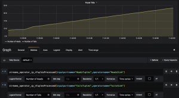
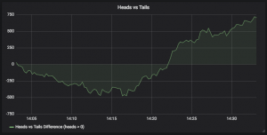

# Monitoring IBM Streams Analytics with Prometheus and Grafana

## Introduction

As a Streams developer or admin, you might need a way to efficiently store and visualize current and historical Streams metrics.  For example, you could compare historical metrics to current values to determine the impact of enhancements or changes to application performance.  You could use current metrics to create application domain specific dashboards (e.g. Translate the `nTuplesSubmitted` metric into a meaningful application context for operations floor personnel).

This tutorial will introduce an approach to monitoring IBM Streams metrics using the [Prometheus](https://prometheus.io/) time-series database and [Grafana](https://grafana.com/) dashboard solution.  A key component to this solution is the [Streams Metric Exporter](https://github.com/IBMStreams/streamsx.jmxclients/tree/develop/streams-metric-exporter), (Current version 4.0.0 works with any IBM Streams 4.x Domain, 5.x support coming soon) which publishes built-in and custom metrics from the IBM Streams JMX Service to the Prometheus database.  This provides a dynamic, interactvive, and customizable capability to create dashboards that can focus on general IBM Streams objects (Jobs, Operators, etc.) as well as be tailored to specific application domains. In this tutorial we will demonstrate these features and provide a launch point for more advanced use cases.

### Table of Contents

- [Monitoring IBM Streams Analytics with Prometheus and Grafana](#monitoring-ibm-streams-analytics-with-prometheus-and-grafana)
  - [Introduction](#introduction)
    - [Table of Contents](#table-of-contents)
  - [Prerequisites](#prerequisites)
    - [Skill Level](#skill-level)
    - [Requirements](#requirements)
  - [Solution Overview](#solution-overview)
    - [Streams Metric Exporter](#streams-metric-exporter)
    - [Prometheus](#prometheus)
    - [Grafana](#grafana)
  - [Tutorial Environment](#tutorial-environment)
  - [Installation and Configuration](#installation-and-configuration)
    - [Docker for Mac](#docker-for-mac)
    - [IBM Streams Quick Start Edition (QSE) for Docker](#ibm-streams-quick-start-edition-qse-for-docker)
      - [IBM Streams Quick Start Edition (QSE) for Docker Setup Steps](#ibm-streams-quick-start-edition-qse-for-docker-setup-steps)
      - [IBM Streams QSE verification](#ibm-streams-qse-verification)
    - [Streams Metric Exporter Installation](#streams-metric-exporter-installation)
    - [Configuration](#configuration)
    - [Create the Streams Metric Exporter Docker image](#create-the-streams-metric-exporter-docker-image)
    - [Start Docker Compose Project](#start-docker-compose-project)
    - [View Grafana sample dashboard](#view-grafana-sample-dashboard)
  - [Start the Streams application](#start-the-streams-application)
  - [View Prometheus Metrics in Streams Metric Exporter](#view-prometheus-metrics-in-streams-metric-exporter)
    - [Prometheus Metrics In-Depth](#prometheus-metrics-in-depth)
      - [Metric Names](#metric-names)
      - [Metric Labels](#metric-labels)
  - [View Metrics in Prometheus](#view-metrics-in-prometheus)
  - [Explore the Sample Graph in Grafana](#explore-the-sample-graph-in-grafana)
  - [Create a new job specific dashboard](#create-a-new-job-specific-dashboard)
    - [Create your first Graph (i.e Panel)](#create-your-first-graph-ie-panel)
    - [Create a Graph to view a Custom Metric](#create-a-graph-to-view-a-custom-metric)
    - [Create a Graph Using Metric Arithmetic](#create-a-graph-using-metric-arithmetic)
  - [Additional items of interest](#additional-items-of-interest)
    - [View status of Prometheus metric exporter targets](#view-status-of-prometheus-metric-exporter-targets)
    - [Additional REST endpoints in Streams Metric Exporter](#additional-rest-endpoints-in-streams-metric-exporter)
  - [Conclusion](#conclusion)
  - [Additional Resources / What’s Next?](#additional-resources--whats-next)

## Prerequisites

### Skill Level

In an effort to focus on developing IBM Streams metric graphs using Grafana, the solution has been pre-configured (“wired”) using [Docker](https://www.docker.com/) and [Docker Compose](https://docs.docker.com/compose/). The components of this solution (Streams Metric Exporter, Prometheus, and Grafana) can be installed independently using many different platform environments (Bare metal, VMs, etc.), however, Docker Compose simplifies the configuration and setup.

This article requires a basic understanding of IBM Streams and the ability to install the Streams Docker QuickStart Edition, and use the _streamtool_ command to submit and cancel Streams applications.

This article does NOT require any previous experience with Grafana, Prometheus, or the Streams Metric Exporter.

### Requirements

This tutorial has been tested on Mac OSX and CentOS Linux.  The following software must be installed or downloaded.  The steps will specify when to perform each installation if they are not already installed:

*   Docker for Mac (or PC / Linux) 17.03.1-ce or above ([https://www.docker.com/docker-mac](https://www.docker.com/docker-mac))
*   IBM Streams Docker Quick Start Edition: Streams4Docker v4.2.4  or above ([https://ibm.co/streamsqs](http://ibm.co/streamsqs))
    *   Access to any IBM Streams Domain 4.1 or above will work with adjustments to the JMX connection information specified.
*   Access to the internet (downloading Streams Metric Exporter and Docker containers)

## Solution Overview

As mentioned before, integrating IBM Streams metrics with a historical data repository and graphing package supports multiple production, testing, and development scenarios including:

*   Application domain specific dashboards (e.g. Translate the `nTuplesSubmitted` metric into a meaningful application context for operations floor personnel)
*   Performance analysis (Did an application enhancement improve or hurt performance?)
*   Anomaly detection
*   Failure detection (Application and Data Feeds)
*   Resource utilization impact
*   Root-cause analysis and correlation (When combined with additional Prometheus exporters such as the node-exporter for system level metrics)

Existing solutions that work with Streams metrics include:

*   The IBM Streams Console, which is very effective for managing  Streams domains, instances, jobs and provides some immediate metric analysis and short-term graphing.  The built-in IBM Streams REST API is also available, however, it does not enable large data transfers of metrics for an entire instance.
*   The [streamsx.monitoring](https://ibmstreams.github.io/streamsx.monitoring) toolkit, which lets you  create Streams applications that monitor other Streams applications.  It is ideal for solutions that identify and select a specific set of metrics to be made available for down stream processing and storage, however, it is  less ideal for bulk metrics gathering.

Unlike these two solutions, however, the StreamsMetricExporter/Prometheus/Grafana solution has the following advantages:

*   Provides a single integrated end to end solution for real-time and historical analysis of all built-in and custom metrics available in Streams.
*   Efficient time-series storage of Prometheus and its built in retention period allows the data to be automatically aged off without additional administrator overhead.

<figure class="wp-caption aligncenter" id="attachment_16742" style="width: 645px">

<figcaption class="wp-caption-text">Figure 1: Solution Architecture</figcaption>

</figure>

Figure 1 illustrates the architecture of the solution:

1.  The Streams Metric Exporter uses a JMX connection to IBM Streams to receive notifications of topology and system changes, pull system and job metrics, and pull job snapshots
2.  Prometheus is configured to periodically “scrape” the REST endpoint defined in the Streams Metric Exporter which provides metrics in the Prometheus format
3.  Grafana dashboards and panels execute PromQL (Prometheus Query Language) against the Prometheus REST endpoint and displays the visualizations

The components are loosely coupled and the solution can be expanded to include additional components.  They can be colocated, or distributed across separate hosts.  They have been deployed in Kubernetes, Docker, VMs, as well as on bare-metal.

### Streams Metric Exporter

The [Streams Metric Exporter](https://github.com/IBMStreams/streamsx.jmxclients/tree/develop/streams-metric-exporter)  uses the IBM Streams JMX API and a built-in Web Server to provide a Prometheus export target for built-in and custom metrics.  When Prometheus “scrapes” the endpoint (`/metrics or /prometheus`) of this service, the service, in turn, calls JMX API calls on the IBM Streams JMX Server to capture Domain, Instance, Resource, and Job information including metrics and job snapshots. Features of this service include:

*   Optimized performance and minimal resource impact using JMX Large Data transfers of job snapshots and metrics for each Streams instance.
*   Security: Supports X509 Certs and TLS1.2 for both incoming connections and Streams JMX connections
*   Resilient to JMX server connection loss and Streams domain restarts
*   Maps operator port numbers to port names for easier metric selection

In addition to the Prometheus endpoint, the Streams Metric Exporter has several JSON REST endpoints including one to check the current configuration (`/config`).

The Streams Metric Exporter release package includes a Docker Compose project which includes Grafana and Prometheus.  In addition, it includes sample dashboards.  These are purely meant to be sample dashboards, and users are encouraged to explore, customize and arrange the graphs (panels) to meet their own needs (as we will demonstrate in this tutorial).

For more information see the [README.md](https://github.com/IBMStreams/streamsx.jmxclients/blob/develop/streams-metric-exporter/README.md) at the link above.

### Prometheus

[Prometheus](https://prometheus.io/) is an open-source time-series database for systems monitoring and alerting.  One of the key features is that it uses a “pull” paradigm for metrics collection.  That is, systems are instrumented to provide an end-point for Prometheus to “scrape”.  Prometheus can be configured to scrape multiple exporters of different types.  This co-mingling of metrics allows for more complex dashboards to be created in Grafana.  For example, system level metrics could be collected and stored from the [Prometheus Node Exporter](https://github.com/prometheus/node_exporter)  and combined in queries with metrics from the Streams Metric Exporter.

Prometheus automatically removes old data after 15 days, however, this retention period is configurable.

Prometheus stores data as time series which are streams of timestamped values belonging to the same metric and the same set of labeled dimensions.

Prometheus has a proprietary query language called PromQL which allows for selection and aggregation of the time-series data. PromQL is used as the query language between Grafana and Prometheus in this tutorial and is also used in the Prometheus UI.

For more information see the Prometheus website link above.

### Grafana

[Grafana](https://grafana.com/) is an open-source dashboard tool that allows you to query, visualize, alert on, and understand your metrics.  Grafana integrates with Prometheus allowing queries to be visualized in many different graph formats.  The Prometheus data source built into Grafana allows metrics to be aggregated as well as broken into series. The Prometheus queries in Grafana are written using PromQL (Prometheus Query Language).  PromQL is an easy to use way to define the queries of the Grafana graphs.

## Tutorial Environment

The tutorial environment is pictured below.  It uses Docker Compose to bring up the Grafana, Prometheus, and Streams Metric Exporter components together.  In addition, it utilizes Docker volumes for the Grafana database (for storing dashboards) and the Prometheus database.  This allows the containers to be stopped, removed, and updated without losing any of the historical data or dashboards.

The tutorial environment also relies on IBM Streams Quick Start Edition for Docker.  In order to get all of the containers to communicate we will modify the `docker-compose.yml` file to utilize the Docker built-in bridge network and Docker links.

## Installation and Configuration

### Docker for Mac

1.  Download and install Docker for Mac: [https://www.docker.com/docker-mac](https://www.docker.com/docker-mac)

**NOTE**: If you are not using a Mac, ensure you install both Docker and Docker Compose on the platform you select.

### IBM Streams Quick Start Edition (QSE) for Docker

#### IBM Streams Quick Start Edition (QSE) for Docker Setup Steps

**NOTE**: At the time of this writing there was a known issue when running the Docker Streams QSE installation script.  Please refer to the Known Issues section of the instructions below.

1.  Before downloading the QSE, it is recommended that you read the first few sections of the [IBM Streams Quick Start for Docker instructions](https://ibmstreams.github.io/streamsx.documentation/docs/4.2/qse-install-docker/) to make sure you have a system that meets the OS and other system requirements.
2.  Once you have determined that you have a suitable system to run the QSE, download the QSE from the [IBM Streams Quick Start Edition download site](https://www-01.ibm.com/marketing/iwm/iwm/web/preLogin.do?source=swg-ibmistvi).
3.  When the download is complete, follow the instructions for installing and setting up the QSE using the document from step 1.

#### IBM Streams QSE verification

1.  Open a terminal (Streams window) and connect to the Streams Docker QSE container

    <pre>ssh -p 4022 streamsadmin@streamsqse</pre>

    (password: passw0rd with a zero instead of an O)

2.  Verify that the domain and instance are started

    <pre>streamtool getdomainstate
    streamtool getinstancestate</pre>

    

3.  Verify the date in the Streams Docker QSE container matches your host date  
    Certain sleep conditions within the container can cause the Network Time Protocol Daemon to become inoperable.  If the dates are not the same, run the following command in the container: (`sudo service ntpd restart`) (sudo password is the same as the streamsadmin password above)
4.  Leave this terminal window open and connected to the Streams Quick Start Edition container

### Streams Metric Exporter Installation

1.  Download the latest release of Streams Metric Exporter onto your host: [https://github.com/IBMStreams/streamsx.jmxclients/releases](https://github.com/IBMStreams/streamsx.jmxclients/releases)
2.  Open a new terminal (Host window) on your host and un-tar the release into it

    <pre>mkdir StreamsMetricExporter
    cd StreamsMetricExporter
    tar -xvf ~/Downloads/streams-metric-exporter-*-release.tar
    cd streams-metric-exporter</pre>

### Configuration

In this tutorial Grafana and Prometheus will be started with slightly modified configuration files and sample dashboards found in the `streams-metric-exporter` release directory.

1.  In the Host window copy the sample.env file

    <pre>cd docker
    cp sample.env .env</pre>

2.  Edit the .env file to configure the connection to IBM Streams Docker Quick Start Edition  
    Set and uncomment the following variables:

    <pre>STREAMS_EXPORTER_JMXCONNECT=service:jmx:jmxmp://streamsqse:9975
    STREAMS_EXPORTER_JMX_SSLOPTION=TLSv1.2
    STREAMS_EXPORTER_USERNAME=streamsadmin
    STREAMS_EXPORTER_PASSWORD=passw0rd
    STREAMS_DOMAIN_ID=StreamsDomain
    STREAMS_EXPORTER_REFRESH_RATE=0</pre>

3.  Backup the original docker-compose.yml file

    <pre>cp docker-compose.yml docker-compose-orig.yml</pre>

4.  Copy the docker-compose file modified for use with the Docker Streams Quick Start Edition

    <pre>cp docker-compose-dsqse.yml docker-compose.yml</pre>

### Create the Streams Metric Exporter Docker image

1.  Use docker-compose command to build the image

    <pre>docker-compose build</pre>

    

### Start Docker Compose Project

1.  Run docker-compose up command to start Grafana, Prometheus, and Streams Metric Exporter in the background

    <pre>docker-compose up -d</pre>

    
2.  Verify the containers are running

    <pre>docker-compose ps</pre>

    

3.  Tail the log of the streams-metric-exporter container to verify it connected to the Streams domain

    <pre>docker-compose logs streamsexporter</pre>

    

### View Grafana sample dashboard

1.  Navigate your browser to the Grafana Login page:  
    [http://localhost:3000](http://localhost:3000/)
2.  Login with the default Grafana credentials  
    username: admin  
    password: admin  
    The Home Dashboard should appear  
    
3.  Select the “IBM Streams Domain Dashboard”  
    This is a sample dashboard and can be edited, saved, and customized.  
    There are no streams jobs running at the moment, but the state of the domain and instance are green which means they are available.  
    

## Start the Streams application

Dashboards are much more interesting with something to observe.  In this tutorial we will use a simple application that simulates flipping a coin over and over.

The work in this section should be performed in the Streams QSE window you opened up earlier.

1.  Clone the streams-metric-exporter-samples repository

    <pre>git clone https://github.com/bmwilli/streams-metric-exporter-samples</pre>

2.  Investigate the HeadsTails SPL application ([Source Code](https://github.com/bmwilli/streams-metric-exporter-samples/blob/master/HeadsTails/HeadsTails.spl))

    <pre>cd streams-metric-exporter-samples
    cd HeadsTails
    cat HeadsTails.spl</pre>

    This simple application flips a coin over and over.  The results are sent to two operators:

    *   A Filter operator separates the Heads and Tails into two different streams and sends them to two Custom operators: HeadsSink and TailsSink.  
        The nTuplesProcessed metric would show how many tuples each of these operators has processed, which is how many heads and tails we have flipped.  
        It would be interesting to monitor this metric and other in Grafana
    *   FlipStats: A Custom() operator keeps track of the maximum number of consecutive flips that are Heads and Tails.  This information is stored in a custom metric (we will use this later).
3.  Compile the HeadsTails application

    <pre>make</pre>

4.  Submit the HeadsTails application

    <pre>make submit</pre>

5.  Visualize the HeadsTails application using StreamsConsole ([https://localhost:8443/streams/domain/console](https://localhost:8443/streams/domain/console)) it will look like this:  
    

## View Prometheus Metrics in Streams Metric Exporter

Streams Metric Exporter contains a specific REST endpoint which Prometheus is configured to periodically “scrape” to gather the current metrcs. This endpoint is “/prometheus”.

1.  Open a new tab in your browser and navigate to the /prometheus endpoint of the Streams Metric Exporter:  
    [http://localhost:25500/prometheus](http://localhost:25500/prometheus)  
    This page will show you the Prometheus format for metrics and verify that the Streams Metric Exporter is running and available

### Prometheus Metrics In-Depth

Metrics in Prometheus are made up of 4 elements

*   Metric name
*   Labels
*   Value
*   Timestamp

#### Metric Names

The metric name specifies the general feature that is being measured.  It contains a prefix relevant to the system and object type (e.g. streams) it falls under.  The Streams Metric Exporter convention for creating Prometheus metrics projects the different objects available in Streams and separates them for clarity.  For example, the Streams metric name “nTuplesSubmitted” is overloaded in Streams and used for processing element (PE) input and output ports as well as operator input and output ports.  For this reason, the streams object type is included in the metric prefixes.  Aggregating these metrics across these four object types does not usually make sense, and the decision to use separate prefixes simplifies metric identification and querying.  The following table lists the metric name prefixes and their mapping to Streams object types.

<table class="tg">

<thead>

<tr>

<th align="left">Metric Name Prefix</th>

<th align="left">Description</th>

</tr>

</thead>

<tbody>

<tr>

<td align="left"><code>streams_domain_</code></td>

<td align="left">domain level metrics and status</td>

</tr>

<tr>

<td align="left"><code>streams_instance_</code></td>

<td align="left">instance level metrics and status</td>

</tr>

<tr>

<td align="left"><code>streams_resource_</code></td>

<td align="left">streams resource metrics</td>

</tr>

<tr>

<td align="left"><code>streams_job_</code></td>

<td align="left">streams job metrics</td>

</tr>

<tr>

<td align="left"><code>streams_pe_</code></td>

<td align="left">streams pe metrics</td>

</tr>

<tr>

<td align="left"><code>streams_pe_ip_</code></td>

<td align="left">streams pe input port metrics</td>

</tr>

<tr>

<td align="left"><code>streams_pe_op_</code></td>

<td align="left">streams pe output port metrics</td>

</tr>

<tr>

<td align="left"><code>streams_pe_op_connection_</code></td>

<td align="left">streams pe output port connection metrics</td>

</tr>

<tr>

<td align="left"><code>streams_operator_</code></td>

<td align="left">streams operator metrics  
**Includes custom metrics</code></td>

</tr>

<tr>

<td align="left"><code>streams_operator_ip_</code></td>

<td align="left">streams operator input port metrics</td>

</tr>

<tr>

<td align="left"><code>streams_operator_op_</code></td>

<td align="left">streams operator output port metrics</td>

</tr>

</tbody>

</table>

The metric names (post-suffix) generated by the Streams Metric Exporter deviate from the naming convention suggested by Prometheus.  IBM Streams metrics convention is camel case.  In an effort to simplify translation between the two domains, the camel case has been retained for built-in metric, and custom metric names.

Examples include:

*   streams_operator_ip_nTuplesProcessed
*   streams_pe_op_nTupleBytesSubmitted
*   streams_pe_launchCount
*   streams_instance_healthy

Those familiar with Streams will notice that launchCount is not a metric, rather it is an attribute of the PE snapshot.  Streams Metric Exporter converts certain attributes to metrics when they make sense to be used in dashboards.  The authors of Streams Metric Exporter are always interested in ideas for additional metrics.

The tutorial will demonstrate how to look at all of the metrics available.

#### Metric Labels

Metric labels are used to identify the individual object instances (e.g. job: job_1, operator: myBeacon, input port: StockTickersIn).  This allows you to query on specific objects or to aggregate the collection of objects.  Grafana even has templates that allow pulldown selectors to specify the objects that should be queried for graphing.  For example, the sample Streams Instance Dashboard allows a user to select a specific Streams instance and job. The Streams Metric Exporter automatically resolves operator input and output ports to names rather than index numbers. This is easier for use in queries.

Note: The labels “instance” and “job” are reserved by Prometheus.  For this reason we use the labels “jobname” and “instancename” for the streams objects.

The following table lists the labels that are used by the Streams Metric Exporter.

<table>

<thead>

<tr>

<th align="left">Label Name</th>

<th align="left">Description</th>

</tr>

</thead>

<tbody>

<tr>

<td align="left"><code>domainname</code></td>

<td align="left">name of the streams domain</td>

</tr>

<tr>

<td align="left"><code>instancename</code></td>

<td align="left">name of streams instance (instance is reserved by prometheus)</td>

</tr>

<tr>

<td align="left"><code>jobname</code></td>

<td align="left">name of streams job (job is reserved by prometheus)</td>

</tr>

<tr>

<td align="left"><code>operatorname</code></td>

<td align="left">name of operator</td>

</tr>

<tr>

<td align="left"><code>inputportname</code></td>

<td align="left">name of input port</td>

</tr>

<tr>

<td align="left"><code>outputportname</code></td>

<td align="left">name of output port</td>

</tr>

<tr>

<td align="left"><code>resource</code></td>

<td align="left">name of streams resource</td>

</tr>

<tr>

<td align="left"><code>peid</code></td>

<td align="left">id of streams processing element</td>

</tr>

<tr>

<td align="left"><code>index</code></td>

<td align="left">index of pe input or output port</td>

</tr>

<tr>

<td align="left"><code>connectionid</code></td>

<td align="left">connection id of streams pe output port connection</td>

</tr>

</tbody>

</table>

## View Metrics in Prometheus

Before creating new dashboards and graphs it is often easier to view the available metrics and labels directly in Prometheus.  The Prometheus UI has the ability to browse metrics, execute PromQL queries, and graph the results.

1.  Open a new tab in your browser and navigate to the prometheus UI:  
    [http://localhost:9090](http://localhost:9090/)  
    
2.  Select the “- insert metric at cursor -” pulldown.  
    Browse all of the metrics that begin with “streams_” . These have all been created by the Streams Metric Exporter.
3.  Select the “streams_operator_ip_nTuplesProcessed” metric  
    It should place the metric in the PromQL expression textbox.
4.  Press the “Execute” button  
    Our HeadsTails application contains four operators with input ports.  Each should be displayed in the “Console” tab.  
    Notice the labels for operator input port metrics include: domainname, instancename, jobname, operatorname, and inputportname.
5.  Modify the PromQL expression in the textbox to select only the metric instances containing a specific label:

    <pre>streams_operator_ip_nTuplesProcessed{inputportname="FlipStream"}</pre>

6.  Press “Execute” button  
    Notice that the list of selected metrics is down to two.  This is because the stream named “FlipStream” is consumed by two separate operators in our application.
7.  Fully select a single metric by adding another label to the PromQL query:

    <pre>streams_operator_ip_nTuplesProcessed{inputportname="FlipStream",operatorname="FlipStats"}</pre>

8.  Select the “Graph” tab to see the histogram for this metric

## Explore the Sample Graph in Grafana

Throughout the remainder of the tutorial we will be working in the Grafana UI to explore and develop new dashboards.

1.  If you do not already have a browser window displaying the Granfa sample graph, navigate your browser to the Grafana Login page:  
    [http://localhost:3000](http://localhost:3000/)
2.  Login with the default Grafana credentials  
    username: admin  
    password: admin
3.  Select the “IBM Streams Domain Dashboard”
4.  The dashboard should now show our streams application running and look something like the figure below.  
    Notice that we now show a job count.  The CPU Rate will take 5 minutes after execution to show up because the query is a 5-minute rate, thus it needs to accumulate 5 minutes worth of metrics before graphing.  This can be adjusted by editing the panel.  
    The Streams Job Resident Memory graph, however, uses the instantaneous values and will begin show values much more quickly.  
    
5.  View the internals of the Streams Jobs CPU Milliseconds Rate panel  
    Click on the panels title bar and select “Edit” from the drop-down menu.

The Grafana Panel editor appears.  Details of all the different options and capabilities of Grafana is well beyond the purpose of this tutorial, however, the panel editor is a good way to see the metrics that are used in the existing graphs.

This panel uses a Prometheus PromQL aggregate rate function over the metric “streams_job_nCpuMilliseconds”.  In addition, this dashboard has a Grafana template variable called “instancename” that allows a user to specify a single streams instance or all streams instances that are being captured into Prometheus.

The metric function in Grafana supports changing the query based on the value of the template variable by specifying a label to the metrics and using the value of the template variable.

In the next section, we will look at a way to see all of the metrics that are available from Prometheus.

## Create a new job specific dashboard

In this section we utilize the metrics collected in Prometheus to create a new dashboard with multiple graphs specific to the HeadsTails application.  
Grafana considers a dashboard a single web page with one or more panels. Each panel can hold a text, and single metric value, or a graph. In this tutorial we will create a few sample panels to introduce the concepts. There is much more to learn and explore with Grafana than we can cover in this tutorial, but it is a start.

### Create your first Graph (i.e Panel)

1.  Using the Grafana UI, press the “+” (Create) palette icon on the left side of the screen and select the “Dashboard” option.  
    
2.  Select the “Graph” icon from the “New Panel” window  
      
    A blank graph should appear.
3.  Left-click on the “Panel Title” and select the “Edit” menu option.
4.  In the query text box enter the first metric to graph

    <pre>streams_operator_ip_nTuplesProcessed{inputportname="HeadsTuples",operatorname="HeadsSink"}</pre>

5.  Type into the “Legend Format” textbox something meaningful to viewers of the dashboard

    <pre>Number of Heads</pre>

6.  Press the “Add Query” button and add a second metric to the graph

    <pre>streams_operator_ip_nTuplesProcessed{inputportname="TailsTuples",operatorname="TailsSink"}
    Legend Text: Number of Tails</pre>

7.  Notice as you add metrics the graph automatically updates, and uses values that have already been collected.  
    
8.  Select the “General” tab in the editor and give the graph a meaningful title such as “Heads and Tails”
9.  Press the “Back to Dashboard” button  in the upper right to return to the dashboard view
10.  Press the “Save Dashboard” button  and give the Dashboard the name: “IBM Streams Heads and Tails Dashboard”

### Create a Graph to view a Custom Metric

A lot of graphs can be created using the IBM Streams built-in metrics.  Adding custom metrics to your applications and displaying them in graphs can often add much more meaning to the information and better convey the current operating picture of your system.

The HeadsTails application used custom metrics to keep track of the maximum number of consecutive flips that were Heads (maxConsecutiveHeads) and the maximum number of flips that were Tails (maxConsecutiveTails).  These are operator metrics, and thus the Streams Metric Exporter will name them as such: streams_operator_maxConsecutiveHeads and streams_operator_maxConsecutiveTails.  If your application used these metric names in multiple places or reused the operator they were created in, the Prometheus metric labels can be used to distinguish which operator to refer.

1.  Press the “Add panel” icon in the upper right bar  and select the “Graph” icon from the “New Panel” window.
2.  Left-click on the “Panel Title” and select the “Edit” menu option.
3.  Create a query for each metric and change the “Legend format” for each:

    <pre>Query: streams_operator_maxConsecutiveHeads
    Legend Format: Heads

    Query: streams_operator_maxConsecutiveTails
    Legend Format: Tails</pre>

4.  Click on the “General” tab and give the panel a meaningful name such as “Max Consecutive Flips”
5.  Click on the “Axis” tab to provide a zero-base on the Y axis
6.  Set Y-min on the LeftY axis to 0 (zero)
7.  Press the “Back to Dashboard” button  in the upper right to return to the dashboard /> 

### Create a Graph Using Metric Arithmetic

The first graph we created shows  the number of Heads and Tails we have flipped.  As we would expect, however, the number is so close it is hard to distinguish the lines on the graph.  In this graph we will graph the difference between the values.  A result greater than zero will represent how many more flips are Heads, and a result less than zero will represent more Tails.

Previously we used the Streams metric “nTuplesProcessed”.  In this example, we will use the output ports of an operator and the “nTuplesSubmitted” metric.  Notice we will need to use the Prometheus query qualifier **ignoring(outputportname)**.  If we do not add that modifier, Prometheus only performs the operation on metrics that share the same set of labels.  Since our metrics have different labels (outputportname) is must be used.

The Prometheus query language supports many functions and operations on metrics.

1.  As in previous steps, press the “Add panel” icon and select “Graph” from the “New Panel” window.
2.  Left-click on the “Panel Title” and select the “Edit” menu option.
3.  Enter the query to subtract the number of Tails from the number of Heads.

    <pre>streams_operator_op_nTuplesSubmitted{outputportname="HeadsTuples"} - ignoring(outputportname) 
    streams_operator_op_nTuplesSubmitted{outputportname="TailsTuples"}</pre>

4.  Enter a meaningful Legend Format:”Heads vs Tails Difference (heads > 0)”
5.  Give the panel a meaningful title
6.  Press the “Back to Dashboard” button in the upper right to return to the dashboard view

With some additional Grafana Panels (Text and Single-stat) you can finalize your dashboard.

## Additional items of interest

### View status of Prometheus metric exporter targets

It is often useful to check the status of targets that Prometheus scrapes for metrics

1.  On the Promethus UI, press the “Status” pull down menu and select the “Targets” option  
    This will display the status of the connection to the Streams Metric Exporter.

Note: The link to the streams-metric-exporter endpoint will not work because the hostname is not available to your host computer.  We will access the exposed URL in the next section.

### Additional REST endpoints in Streams Metric Exporter

In addition to `/metrics or /prometheus`, there are several other REST endpoints available.

1.  View the configuration parameters that were used to start the Streams Metric Exporter:  
    [http://localhost:25500/config](http://localhost:25500/config)
2.  View a JSON view of the information the Streams Metric Exporter retrieves from IBM Streams JMX API:  
    [http://localhost:25500/streamsexporter](http://localhost:25500/streamsexporter)

## Conclusion

This article has shown a very powerful approach to capturing, storing, and visualizing IBM Streams metrics.  These results can be used by developers and operations folks to monitor and even performance measure applications.

There are a few best practices that have been adopted by users of this solution (more to come):

*   The Prometheus scrape interval which defines how often Prometheus pulls metrics from each target, can be configured. In this lab, the configuration is set for every 10 seconds, however, in production 60 seconds may be more appropriate.
*   Visualize and test queries using the Prometheus UI before using them in Grafana
*   Submit jobs with job names (`--jobname` option).  This allows setting the jobname label in queries so that when jobs are cancelled and resubmitted the query does not have to be changed.  If you do let streams generate the jobname you will need to use a regex pattern to match the jobname label for a specific job since Streams will name the job with a numeric suffix (e.g. myjob_1, my_job_2, etc.)

## Additional Resources / What’s Next?

*   Streams Metric Exporter README: [https://github.com/IBMStreams/streamsx.jmxclients/blob/develop/streams-metric-exporter/README.md](https://github.com/IBMStreams/streamsx.jmxclients/blob/master/streams-metric-exporter/README.md)
*   Grafana Documentation: [http://docs.grafana.org/](http://docs.grafana.org/)
*   Prometheus Documentation: [https://prometheus.io/docs/](https://prometheus.io/docs/)
*   [IBM Streams Quick Start Edition](https://www-01.ibm.com/marketing/iwm/iwm/web/preLogin.do?source=swg-ibmistvi)
*   Questions or Feedback?  Please leave a comment below